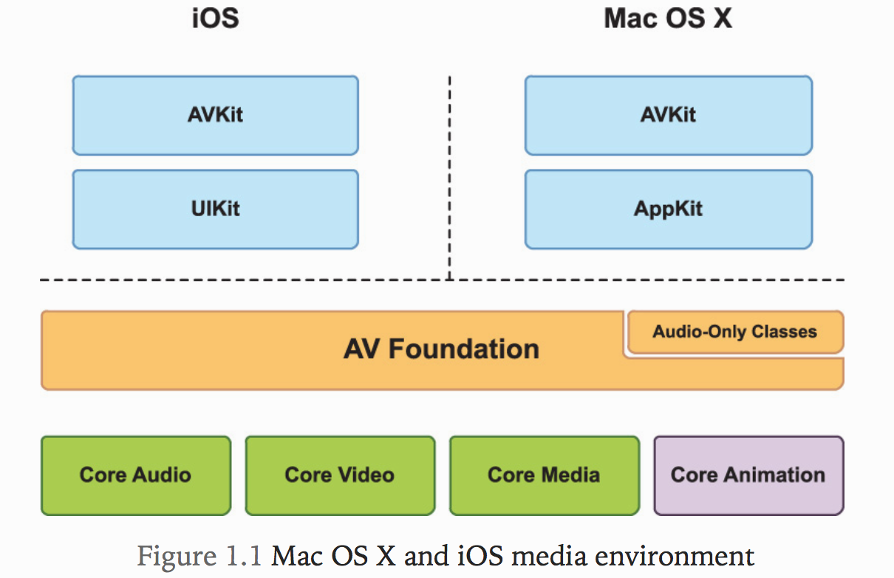
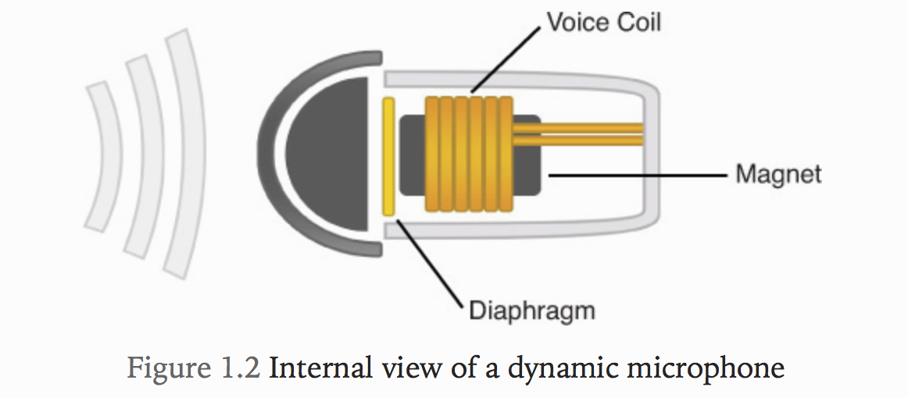
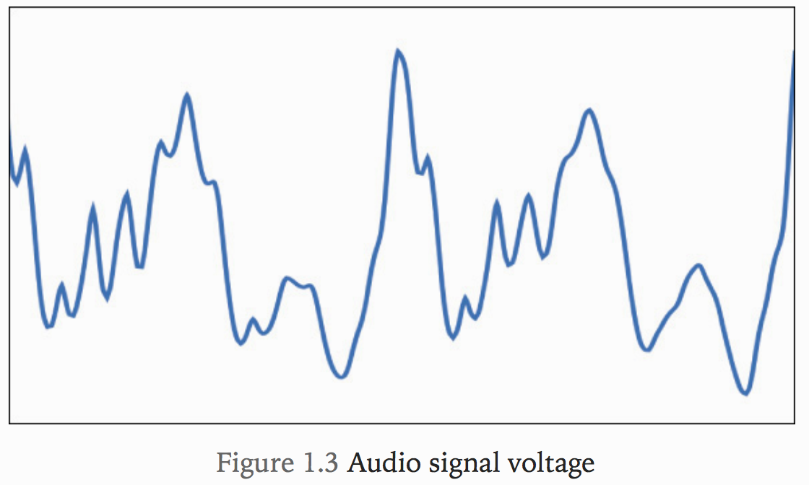
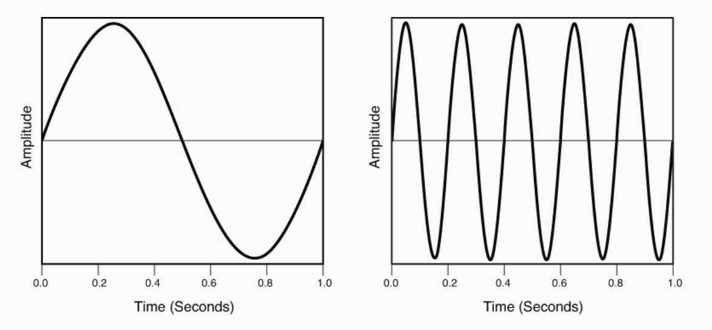
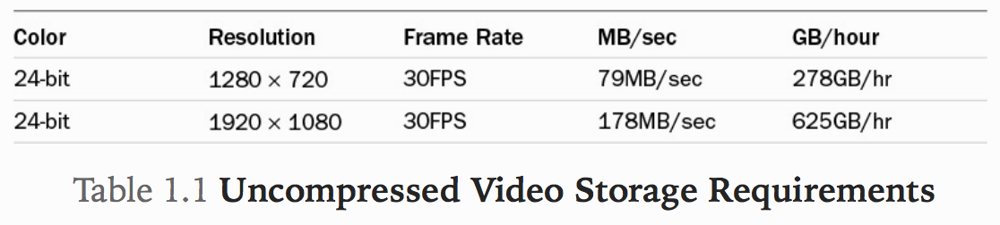
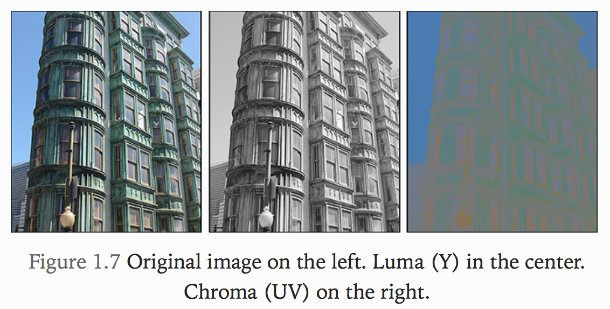
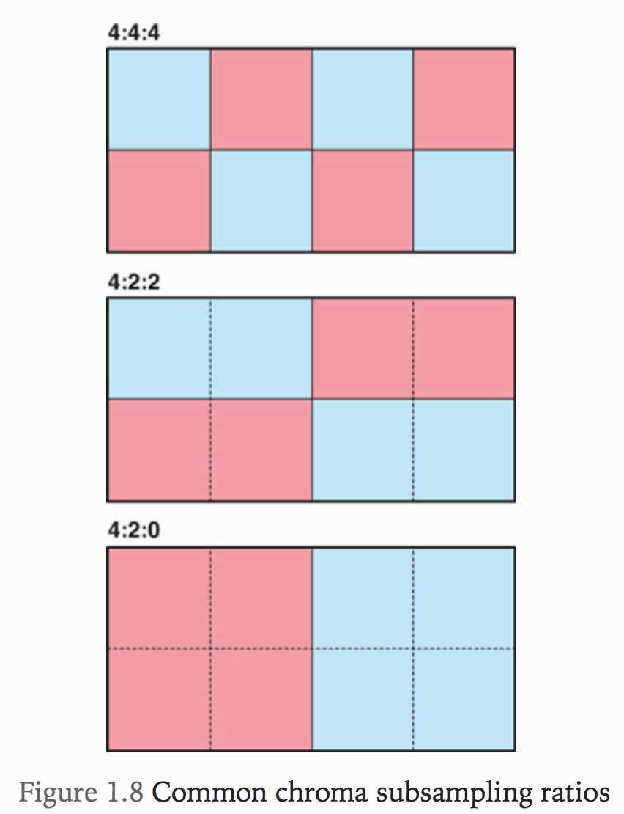
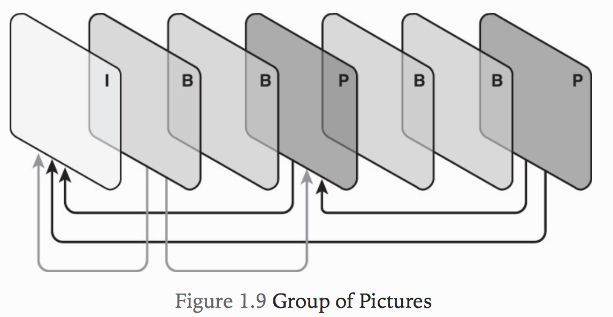
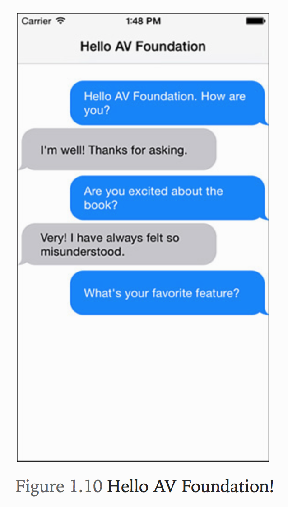

# 1. Getting Started with AV Foundation

* Apple은 오랫동안 디지털 미디어 세계에서 원동력이었습니다. 1991 년에 처음으로 디지털 오디오 및 비디오를 대중에게 가져온 QuickTime이 도입되었습니다. QuickTime 아키텍처는 향후 20 년간 디지털 멀티미디어에 혁명을 가져올 것이며 교육, 게임 및 엔터테인먼트 산업에 상당한 영향을 미칩니다. 2001 년에 Apple은 iTunes와 iPod에 세계를 소개하면서 음악을 듣는 방식을 근본적으로 바꿨습니다. 2 년 후 발표 된 아이튠즈 스토어는 음악 산업을 뒤흔들었고 이후 애플의 끊임없이 확장되는 디지털 미디어 생태계의 중심이되었다. 2007 년에 우리는 iPhone을 소개했고 몇 년 후 iPad를 출시했습니다. 이러한 이벤트는 완전히 새로운 컴퓨팅 시대를 열었으며 미디어를 제작, 소비 및 공유하는 방식을 영원히 바꿔 놓았습니다.
* 디지털 미디어의 세계는 기술적 인 측면에서만 더 이상 알려지지 않습니다. 오늘날 디지털 미디어는 간단하고 필수적이며 보편적이며 힘을 실어주고 있습니다. Instagram과 같은 앱을 사용하면 아름답고 예술적인 정지 이미지를 손쉽게 가져 와서 세상과 공유 할 수 있습니다. Skype에서 TangoMe에 이르는 화상 채팅 응용 프로그램을 사용하면 친구와 가족을 어디든지 데려 갈 수 있습니다. YouTube와 Netflix에서 제공하는 스트리밍 비디오는 결코 LTE 또는 Wi-Fi 신호 이상의 것입니다. iPad 용 Final Cut Pro X 및 iMovie와 같은 도구는 고급 사용자와 초보자 모두에게 손쉽게 비디오 편집 기능을 제공합니다.
* 디지털 미디어 혁명이 여기에 있지만, 이제 막 시작했습니다. AV Foundation을 사용하는 방법을 배우는 것이 Mac OS X 및 iOS 용 차세대 미디어 응용 프로그램을 만드는 열쇠입니다.이 책은 안내서로 사용됩니다. 프레임 워크의 필수 개요를 제공하여 프레임 워크를 마스터하는 데 필요한 통찰력과 이해를 제공합니다. Let's go!

## What is AV Foundation?
* AV Foundation은 OS X 및 iOS에서 시간 기반 미디어로 작업하기위한 Apple의 고급 Objective-C 프레임 워크이다.
* 이 소프트웨어는 하드웨어 가속 작업을 자동으로 제공하여 다양한 장치에서 최상의 성능을 보장한다. iPhone 및 iPad와 같은 장치의 요구 사항을 충족할 수 있도록 전력 효율이 높도록 설계되었으며 64 비트 하드웨어를 처음부터 최대한 활용하여 기본으로 64비트로 작성되었습니다.

## Where Does AV Foundation Fit?
* AV Foundation을 배우기 위한 첫 번째 단계 중 하나는 Apple의 전반적인 미디어 환경에서 어디에 해당되는지 명확하게 이해하는 것이다.



* 두 플랫폼은 모두 최신 비디오 재생 응용 프로그램을 단순화하는 AVKit 프레임 워크를 제공한다. 그러나 이러한 솔루션이 편리하기는 하지만 보다 고급 응용프로그램에 필요한 유연성과 제어 기능이 부족한 경우가 많다.
* 스펙트럼의 다른쪽 끝에는 모든 상위 레벨 솔루션에서 사용되는 지원기능을 제공하는 몇 가지 하위 프레임워크가 있다. 이러한 프레임워크는 C기반이지만 강력한 이해가 필요하다.
* 주요 지원 프레임워크 와 각 기능이 제공하는 주요 키를 살펴보자.
  * CoreAudio
    * Core Audio는 OS X 및 iOS의 모든 오디오 처리를 다루며 오디오 및 MIDI 컨텐트의 녹음, 재생 및 처리를 위한 인터페이스를 제공한다.
    * Apple의 Logic Pro X 및  Pro Tools와 같은 도구에서 사용되는 것과 같은 정교한 오디오 처리 기능을 구현할 수 있는 매우 낮은 수준의 인터페이스, 특히 Audio Units를 제공한다.
  * Core Video
    * Core Video는 OS X 및 iOS에서 디지털 비디오를 위한 파이프 라인 모델을 제공한다. 이미지 버퍼 및 버퍼 풀 지원을 Core Media에 제공하여 디지털 비디오의 개별 프레임에 액세스 하기위한 인터페이스를 제공한다.
  * Core Media
    * Core Media는 AV Foundation에서 사용하는 저수준 미디어 파이프 라인의 일부이다. 오디오 샘플 및 비디오 프레임 작업에 필요한 저수준 데이터 유형 및 인터페이스를 제공한다.
  * Core Animation
    * Core Animation은 OS X 및 iOS에서 제공되는 합성 및 애니메이션 프레임 워크이다. Core Animation을 사용하여 AV Foundation은 재생 및 비디오 캡처 시나리오에서 비디오 컨텐츠의 하드웨어 가속 렌더링을 제공한다. 또한 이를 이용하여 비디오 편집 및 재생 시나리오에서 움직이는 제목 및 이미지 효과를 추가할 수 있다.

* AV Foundation은 UIKit 및 AppKit 레이어 아래에 위치하기 때문에 두 플랫폼 모두에서 사용할 단일 미디어 프레임 워크가 있음을 의미한다. 배울 수있는 프레임 워크는 하나 뿐이며, 코드뿐 아니라 지식과 경험을 어느 플랫폼 으로든 포팅 할 수있는 기회를 제공한다.

## Decomposing AV Foundation
* AV Foundation을 사용하는 것을 배우는 데있어 가장 큰 어려움 중 하나는 프레임 워크가 제공하는 수많은 클래스를 이해하는 것이다.
* 제공되는 기능의 핵심 영역을 살펴보자.
  * Audio Playback and Recording
    * 그림 1.1의 오른쪽 위 모서리에 Audio-Only라고 표시된 작은상자.
    * AVAudioPlayer 및 AVAudioRecorder는 오디오 재생 및 녹음을 응용 프로그램에 통합하는 쉬운 방법을 제공한다.
  * Media Inspection
    * AV Foundation은 미디어를 검사하는 기능을 제공한다. 미디어 Assets을 검사하여 특정 작업에 대한 적합성을 판단할 수 있다.(예: 재생에 사용할 수 있는지 또는 편집하거나 내보낼 수 있는지 여부)
    * 재생 시간, 생성 날짜 또는 기본 재생 볼륨과 같은 미디어에 대한 기술적 속성을 검색할 수 있다.
    * AVMetadataItem 클래스를 기반으로하는 강력한 메카 데이터 지원을 제공한다.
  * Video Playback
    * AV Foundation의 보다 일반적인 용도 중 하나는 비디오 재생을 제공하는 것이다.
    * 이것을 사용하면 로컬파일이나 원격 스트림에서 비디오 에셋을 재생하고 비디오 내용의 재생 및 표시를 제어할 수 있다.
    * 이 영역의 중심 클래스는 자막 및 subtitles 정보와 같은 고급 기능을 통합할 뿐 만 아니라 Assets 재생을 제어할 수 있는 AVPlayer 및 AVPlayerItem 클래스이다.
  * Media Capture
    * AV Foundation은 다양한 API 세트를 제공하므로 Mac 및 모든 iOS의 내장 카메라 장치의 기능을 세밀하게 제어할 수 있다. 캡처 시나리오의 중심 클래스는 AVCaptureSession이다. 이는 카메라 장치 출력을 동영상 및 이미지 파일 뿐 만 아니라 미디어 스트림으로 라우팅하기 위한 활동의 중심 허브이다.
  * Media Editing
    * AV Foundation은 또한 미디어 구성 및 편집을 매우 강력하게 지원한다. 이 기능을 사용하면 여러 오디오 및 비디오 트랙을 함께 구성하고 개별 미디어 클립을 자르고 편집하고, 시간 경과에 따른 오디오 매개변수를 수정하고, 애니메이션 제목 및 전환 효과를 추가할 수 있는 응용 프로그램을 만들 수 있다.
  * Media Processing
    * AV Foundation에서 고급 미디어 처리를 수행해야 하는 경우 AVAssetReader 및 AVAssetWriter 클래스를 사용하여 처리할 수 있다. 이 클래스는 비디오 프레임 및 오디오 샘플에 직접 액세스 할 수 있으므로 필요한 고급 처리를 수행할 수 있다.

## Understanding Digital Media
* 우리가 보는 모든 시력과 모든 소리는 아날로그 신호로 우리에게 전달되며, 우리의 두뇌가 이를 전기적 자극으로 변환한다.
* 실제 세계의 신호는 주파수와 강도가 지속적으로 변하지만 디지털세계의 신호는 이산 상태이며 1 또는 0 중 하나의 상태를 가지고 있다.
* 아날로그 신호를 디지털 방식으로 저정하고 전송할 수 있는 형태로 변환하려면 샘플링이라고 하는 아날로그 - 디지털 변환 프로세스를 사용한다.

## Digital Media Sampling
* 미디어를 디지털화 할 때 사용되는 두가지 주요 유형의 샘플링이 있다.
  * 시간 샘플링 - 시간 경과에 따른 신호의 변화를 캡처할 수 있다. 예를들어 iPhone에 음성 메모를 녹음하면 녹음 기간 동안 피치와 음량의 연속적인 변화가 캡처된다.
  * 공간 샘플링 - 결과 디지털 이미지의 픽셀 데이터를 생성하기 위해 이미지의 luminance(light)와 chrominance(color)을 어느정도의 해상도로 캡처링하는 것을 포함한다.
* 아날로그 - 디지털 변환은 하드웨어 구성 요소가 처리하는데 이 처리방식과 디지털 미디어의 저장 형식에 대한 기본적인 이해를 하지 못하면 AV Foundation의 진보된 흥미로운 기능을 사용할 수 있는 능력이 제한될 것이다.

## Understanding Audio Sampling
* 누군가의 목소리, 경적 소리 또는 기타의 소리를 들을 때 실제로 들리는 소리는 어떤 매체에서 음파를 통해 전달되는 진동이다.
* 이 진동은 주위의 공기 분자를 움직이게 하고, 이웃하는 분자들과 밀착하여 초기 진동에서부터 모든 방향으로 연속적으로 에너지를 전달한다.
* 이 에너지가 귀에 닿으면 고주파가 동일한 주파수와 진폭으로 진동한다. 이 진동은 내이의 달팽이관으로 전달되어 뇌에 전달되는 전기 자극으로 변환된다.
* 마이크로폰(마이크)는 기계 에너지(음파)를 전기 에너지(전압)로 변환하는 변환장치이다.



* 말하는 부분인 헤드 케이스 안에는 다이어프램이라는 얇은 멤브레인이 있다. 다이어프램은 자석 주위에 싸인 와이어 코일에 연결된다. 마이크에 대고 말하면 진동판은 감지하는 음파와 관련하여 진동한다. 이것은 차례로 와이어 코일을 진동시켜 입력 신호의 주파수 및 진폭에 비례하여 전류를 발생시킨다.
* 오실로스코프를 사용하면 그림 1.3과 같이이 전류의 진동을 볼 수 있다.



* 오디오 신호의 필수 요소에 대해 좀 더 자세히 살펴보자. 톤 제너레이터를 사용하여 그림 1.4와 같은 사인파를 생성하는 두 가지 톤을 생성했다.



* 이 신호의 두가지 측면에 관심이 있다. 첫 번째는 신호의 전압 또는 상대 강도의 크기를 나타내는 진폭이다. 이것은 다양한 스케일로 나타낼 수 있지만 일반적으로 -1.0 ~ 1.0의 번위로 정규화된다. 이 신호의 또 다른 흥미로운 점은 주파수이다. 신호의 주파수는 헤르츠(Hz)로 측정된다. 이는 1초의 기간 동안 얼마나 많은 완전한 사이클이 발생했는지 나타낸다.
* 그림 1.4의 왼쪽에있는 이미지는 1Hz에서 순환하는 오디오 신호를 보여 주며 오른쪽에있는 이미지는 5Hz 신호를 보여준다. 인간은 20Hz ~ 20kHz (20,000Hz)의 가청 주파수 범위를 가지므로 두 신호 모두 들리지는 않지만 쉽게 설명 할 수 있다.

```
Note
인간의 청력은 20Hz ~ 20kHz의 가청 주파수 범위를 가지지 만, 그 범위는 실제로 이론적 경계를 나타냅니다. 시끄러운 환경에 노출 될 경우 청력이 감소하기 때문에 그 범위의 바깥 쪽에서 주파수를들을 수있는 사람은 거의없고 나이를 먹으면 빠르게 감소합니다. 락 콘서트에가 본 적이 있다면 그 범위의 윗부분이 없어 졌음을 확신 할 수 있습니다.
다양한 주파수의 사운드에 대한 참조 프레임을 제공하기 위해 피아노의 가장 낮은 건반 A0은 27.5Hz의 주파수를 생성하고 가장 높은 건반 인 C8은 약 4.1kHz의 주파수를 생성합니다.
```

* 오디오 Digitizing은 Linear PCM 또는 LPCM이라고 하는 선형 펄스 코드 변조 인코딩 방법을 포함한다. 이 프로세스는 샘플링 속도라고하는 고정 된 주기적 속도로 오디오 신호의 진폭을 샘플링하거나 측정한다. 그림 1.5는 1초동안 이 신호의 7개 샘플을 취한 결과 신호의 디지털 표현을 보여준다.


* 명백하게 낮은 샘플링 속도에서 이 신호의 디지털 버전은 원본과 거의 유사하지 않다. 이 디지털 오디오를 재생하면 클릭 수와 팝음이 거의 발생하지 않는다. 그림 1.5에 나와있는 샘플링의 문제점은 신호를 정확하게 포착하기에 충분히 빈번하게 샘플링하지 않는다는 것이다.
* 그림 1.6에서 다시 시도해보자. 이 때 샘플링 속도를 높여보자.


* 분명히 개선되었지만 여전히 신호의 매우 정확한 표현은 아니다. 그러나 이예에서 추측할 수 있는것은 샘플 속도의 빈도를 계속 늘리면 원래 소스를 상당히 정확하게 미러링 한 디지털 표현을 생성할 수 있어야 한다는 것이다.
* 벨 연구소에서 특정 주파수를 정확히 포착하기 위해서는 가장 높은 주파수 속도의 2배 이상의 속도로 샘플링 해야한다는것을 발견했다.
* 예를 들어 캡처하려는 오디오 자료의 최고 주파수가 10kHz 인 경우 정확한 디지털 표현을 제공하려면 적어도 20kHz의 샘플 속도가 필요하다.
* 비디오는 프레임이라고하는 일련의 이미지로 구성된다. 각 프레임은 비디오의 타임라인에서 특정 시점의 장면을 캡처한다.
* 1초에 표시되는 프레임 수는 비디오 프레임 속도라고하며 `초당 프레임 수(FPS)`로 측정된다. 가장 일반적인 프레임 속도는 24FPS, 25FPS 및 30FPS등이 있다.
* 압축되지 않은 비디오 컨텐츠의 저장 요구 사항을 이해하려면 먼저 각 개별 프레임의 크기를 결정해야한다. 다양한 일반적인 비디오 크기가 있지만 요즘에는 일반적으로 가로 세로 비율이 16 : 9이다. 즉 가로 세로 9 픽셀 당 16 개의 가로 픽셀이 있다. 이 종횡비의 가장 일반적인 두 가지 크기는 1280 × 720 및 1920 × 1080이다. 픽셀 자체는 어떻습니까? 8 비트를 사용하여 RGB 색상 공간의 각 픽셀을 표현한다면 빨강 색 8 비트, 녹색 8 비트, 파란색 8 비트 또는 24 비트를 가질 수 있다. 모든 입력이 모여서 몇 가지 계산을 수행해 봅시다. 표 1.1은 가장 일반적인 두 가지 해상도에서 30FPS의 비 압축 비디오 저장 요구 사항을 보여준다.



* 오늘날 대부분의 경우 이 방법은 적합하지 않다. 대부분의 비디오를 저장하고 전송하는 것이 합리적이지 않기 때문에 이 크기를 줄이는 방법을 찾아야 한다. 이것은 압축의 주제로 우리를 데려다 준다.

## Digital Media Compression
* 디지털 미디어의 크기를 줄이려면 압축을 사용해야한다. 사실 우리가 소비하는 모든 미디어는 다양한 수준으로 압축된다. TV에서 비디오, Blu-ray 디스크, 웹에서 스트리밍 또는 iTunes Store에서 구입 한 모든 것을 압축 형식으로 처리한다. 디지털 미디어를 압축하면 파일 크기가 크게 줄어들지만 품질은 거의 저하되지 않는다.

## Chroma Subsampling
* 비디오 데이터는 일반적으로 `Y'CbCr`이라는 컬러 모델을 사용하여 인코딩되며 일반적으로 `YUV`라고한다. YUV라는 용어는 기술적으로 부정확하지만 YUV는 Y-Prime-C-B-C-R보다 혀에서 벗어난 것 같다. 대부분의 소프트웨어 개발자는 모든 픽셀이 빨간색, 녹색 및 파란색의 값으로 구성되는 RGB 색상 모델에 더 익숙하다. Y'CbCr 또는 YUV는 대신 픽셀의 루마 채널 Y (밝기)와 채도 (색상) 채널 UV를 분리한다. 그림 1.7은 이미지의 루마와 크로마 채널을 분리하는 효과를 보여준다.



* 루마 채널에는 이미지의 모든 세부 사항이 보존되어 회색 음영 이미지가 남는 반면, 채도 채널을 결합하면 거의 모든 세부 사항이 손실된다는 것을 알 수 있다. 우리의 눈은 색보다 밝기에 훨씬 민감하기 때문에 영리한 엔지니어는 이미지의 품질을 유지하면서 각 픽셀에 저장된 색 정보의 양을 줄일 수 있다는 것을 깨달았다. 컬러 데이터를 줄이기 위해 사용되는 프로세스를 `크로마 서브 샘플링`이라고합니다.
* 4 : 4 : 4, 4 : 2 : 2 또는 4 : 2 : 0과 같은 숫자를 참조하는 카메라 사양이나 기타 비디오 하드웨어 또는 소프트웨어를 볼 때마다이 값은 사용하는 채도 하위 샘플을 참조합니다. 이 값은 J : a : b 형식의 luminance대 chrominance의 비율을 나타냅니다.
  * J : 일부 참조 블록 내에 포함 된 픽셀 수 (일반적으로 4)이다.
  * a :는 첫 번째 행의 모든 J 픽셀에 대해 저장되는 색차 픽셀 수이다.
  * b :는 두 번째 행의 모든 J 픽셀에 대해 저장되는 추가 픽셀 수이다.
* 이미지의 품질을 유지하려면 모든 픽셀마다 고유 한 luma 값이 필요하지만 자체의 채도 값을 가질 필요는 없다. 그림 1.8은 일반적인 서브 샘플링 비율과 각각의 효과를 보여준다.



* 모든 형태에서 전체 luminance가 모든 픽셀에 걸쳐 보존되며 4 : 4 : 4 풀 컬러 정보도 보존된다. 4 : 2 : 2에서는 색상 정보가 수평 2 픽셀마다 평균화되어 2 : 1 루마 - 크로마 비율을 얻는다. 4 : 2 : 0에서는 색상 정보가 수평 및 수직으로 평균화되어 4 : 1 루마 - 크로마 비율을 얻는다.
* 크로마 서브 샘플링은 일반적으로 획득 시점에 발생한다. 일부 전문 카메라는 4 : 4 : 4로 캡처하지만 더 일반적으로는 4 : 2 : 2로 캡처한다. iPhone에서 발견되는 것과 같은 소비자 지향적 인 카메라는 4 : 2 : 0으로 캡처된다. iPhone에서 촬영할 수 있는 비디오의 품질에서 알 수 있듯이 상당한 수준의 하위 샘플링에서도 고화질 이미지를 캡처 할 수 있다. 색상 손실은 후반 작업 과정에서 크로마 키잉 또는 색상 보정을 수행 할 때 더욱 문제가된다. 크로마 정보는 여러 픽셀에 걸쳐 평균화되므로 노이즈 및 기타 아티팩트가 이미지에 입력 될 수 있다.

## Codec Compression
* 대부분의 오디오 및 비디오는 인코더 / 디코더의 약자 인 코덱을 사용하여 압축됩니다. 코덱은 고급 압축 알고리즘을 사용하여 오디오 또는 비디오 데이터를 인코딩하여 디지털 미디어를 저장하거나 전달하는 데 필요한 크기를 크게 줄이는 데 사용됩니다. 코덱은 미디어를 압축 된 상태에서 재생 또는 편집하기에 적합한 것으로 디코딩하는데도 사용됩니다.
* 코덱은 손실 또는 손실 중 하나가 될 수 있습니다. 무손실 코덱은 압축을 풀 때 완벽하게 재구성 할 수있는 방식으로 미디어를 압축하므로 편집 용도 나 제작 용도, 보관 목적에 이상적입니다. zip이나 gzip과 같은 유틸리티를 사용할 때 자주 이러한 유형의 압축을 사용합니다. 손실 코덱은 이름에서 알 수 있듯이 압축 프로세스의 일부로 데이터를 잃습니다. 이 압축 형식을 사용하는 코덱은 인간의 인식을 기반으로 한 고급 알고리즘을 사용합니다. 예를 들어 이론적으로 20Hz와 20kHz 사이의 주파수를들을 수는 있지만 1kHz와 5kHz 사이의 주파수에 특히 민감합니다. 주파수에 대한 우리의 감도는이 범위보다 높거나 낮아지면서 점점 좁아지기 시작합니다.
* 이러한 지식 기반 하에 오디오 코덱은 필터링 기술을 사용하여 오디오 파일의 특정 주파수를 줄이거나 없앨 수 있습니다. 이것은 사용 된 많은 방법 중 하나 일 뿐이지 만 손실이 많은 코덱의 목표는 심리 음향 또는 심리 - 시각적 모델을 사용하여 미디어의 중복성을 줄여 품질을 거의 또는 전혀 저하시키지 않게하는 것입니다.
* AV Foundation에서 제공하는 코덱을 살펴보자.

## Video Codecs
* AV Foundation은 상당히 제한된 코덱 세트를 지원합니다. Apple이 오늘날의 미디어와 가장 관련 있다고 생각하는 것만 지원합니다. 비디오와 관련해서는 주로 H.264 및 Apple ProRes로 이어집니다. H.264 비디오를 살펴 보겠습니다.

### H.264
* 비디오를 인코딩 할 때는 AV Foundation이 H.264 인 한 원하는 모든 비디오 코덱을 지원한다고 말하면서 Henry Ford의 말을 바꿔 볼 것입니다. 다행히도 업계에서는 이 코덱을 통합했습니다. 소비자 비디오 카메라에 널리 사용되며 웹에서 비디오 스트리밍에 사용되는 주요 형식입니다. iTunes Store에서 다운로드 한 모든 비디오는이 코덱을 사용하여 인코딩됩니다. H.264 규격은 MPEG (Motion Picture Experts Group)에 의해 정의 된보다 큰 MPEG-4 부품 14 사양의 일부입니다. H.264는 초기 MPEG-1 및 MPEG-2 표준을 기반으로하지만 더 낮은 비트 전송률로 크게 향상된 이미지 품질을 제공하므로 스트리밍 및 모바일 장치 및 비디오 카메라에 이상적입니다.

* H.264는 MPEG 압축의 다른 형식과 함께 두 가지 방식으로 비디오 내용의 크기를 줄입니다.
  * Spatially : 이는 개별 비디오 프레임을 압축하며 이를 인트라 프레임 압축이라고합니다.
  * Temporally : 비디오 프레임 그룹 전체의 중복을 압축합니다. 이것을 프레임 간 압축이라고합니다.

* 프레임 간 압축을 사용하면 프레임이 GOP(Group of Pictures)로 그룹화됩니다. 이 GOP 내에서 시간상 중복성이 제거 될 수 있습니다. 비디오의 전형적인 장면을 생각하면 거리를 걷는 자동차 운전자 나 거리를 걷는 사람과 같이 움직이는 요소가 있지만 배경 환경은 종종 고정되어 있습니다. 고정 된 배경은 압축을 통해 제거 될 수있는 시간 중복성을 나타냅니다.
* 그림 1.9와 같이 GOP 내에 저장되는 세 가지 유형의 프레임이 있습니다.



  * I-frames: 독립 실행 형 또는 키 프레임이며 전체 이미지를 만드는 데 필요한 모든 데이터가 들어 있습니다. 모든 GOP에는 정확히 하나의 I 프레임이 있습니다. 독립 실행 형 프레임이므로 크기가 가장 크지만 압축을 해제하는 데 가장 빠릅니다.
  * P-frames: P- 프레임 또는 예측 된 프레임은 가장 가까운 I- 프레임 또는 P- 프레임을 기반으로 "예측 된"그림에서 인코딩됩니다. P 프레임은 가장 가까운 선행 P 프레임 또는 그룹의 I 프레임의 데이터를 참조 할 수 있습니다. 이웃 P 프레임과 B 프레임이 참조 프레임을 참조 할 수 있으므로이를 참조 프레임이라고 부르는 것을 자주 보게됩니다.
  * B-frames: B- 프레임 또는 양방향 프레임은 그 앞뒤에 오는 프레임 정보를 기반으로 인코딩됩니다. 공간이 거의 필요하지 않지만 주변 프레임에 의존하기 때문에 압축을 해제하는 데 시간이 오래 걸립니다.

* H.264는 인코딩 프로세스 중에 사용 된 알고리즘을 결정하는 인코딩 프로파일을 추가로 지원합니다. 다음 세 가지 최상위 프로필이 정의됩니다.
  * Baseline: 이 프로파일은 일반적으로 모바일 장치 용 미디어를 인코딩 할 때 사용됩니다. 가장 효율적인 압축을 제공하므로 파일 크기가 커지지만 B 프레임을 지원하지 않기 때문에 계산량이 가장 적습니다. iPhone 3GS와 같이 구형 iOS 기기를 타겟팅하는 경우 기준 프로파일을 사용해야합니다.
  * Main: 이 프로필은 사용 가능한 알고리즘의 수가 더 많기 때문에 기준보다 계산 집약적이지만 압축률은 높아집니다.
  * High: 이 프로필을 사용하면 가장 높은 품질의 압축이 사용되지만 인코딩 기술과 알고리즘의 모든 부분이 사용되기 때문에 3 가지 중에서 가장 집중적입니다.

### Apple ProRes
* AV Foundation은 Apple ProRes 코덱의 두 가지 flavors을 지원합니다. Apple ProRes는 전문 편집 및 제작 워크 플로우를 위해 제작 되었기 때문에 intermediate 또는 mezzanine 코덱으로 간주됩니다. Apple ProRes 코덱은 프레임 독립적이며 I 프레임만 사용되므로 편집하기에 더 적합합니다. 그들은 또한 장면의 복잡성을 기반으로 각 프레임을 인코딩하는 데 사용되는 비트 수를 변경하는 가변 비트 전송률 인코딩을 사용합니다.
* ProRes는 손실이 많은 코덱이지만 `최고 품질`입니다. Apple ProRes 422는 4 : 2 : 2 크로마 하위 샘플링과 10 비트 샘플 깊이를 사용합니다. Apple ProRes 4444는 4 : 4 : 4 크로마 하위 샘플링을 사용하며 마지막 4는 무손실 알파 채널과 최대 12 비트 샘플 깊이를 지원함을 나타냅니다.
* ProRes 코덱은 `OS X`에서만 사용할 수 있습니다. iOS 전용으로 개발하는 경우 H.264가 유일한 게임입니다. 그러나 Apple은 iFrame이라는 편집 목적으로 캡처 할 때 사용할 수있는 일반적인 H.264 인코딩에 한 가지 변형을 제공합니다. 이것은 편집 환경에보다 적합한 H.264 비디오를 생성하는 I- 프레임 전용 변형입니다. 이 형식은 AV Foundation에서 지원되며 Canon, Panasonic 및 Nikon과 같은 다양한 카메라 제조업체에서 추가로 지원합니다.

```
Note
AV Foundation은 H.264 및 Apple ProRes 외에도 MPEG-1, MPEG-2, MPEG-4, H.263 및 DV와 같은 다양한 비디오 카메라 장치 코덱을 지원하므로 다양한 종류의 콘텐츠를 가져올 수 있습니다.
```

### Audio Codecs
* AV Foundation은 Core Audio 프레임 워크가 지원하는 모든 오디오 코덱을 지원합니다. 즉 다양한 포맷에 대한 광범위한 지원을 의미합니다. 그러나 선형 PCM 오디오를 사용하지 않는 경우 가장 자주 사용하는 오디오는 AAC입니다.

### AAC
* AAC(Advanced Audio Coding)는 H.264와 유사한 오디오 스트리밍 및 다운로드에 사용되는 주요 형식입니다. MP3를 크게 개선하여 낮은 비트 전송률에서 높은 음질을 제공하므로 웹 배포에 이상적입니다. 또한 AAC는 오랫동안 MP3를 괴롭히는 라이센스 및 특허 제한을 가지고 있지 않습니다.

```
Note
AV Foundation 및 Core Audio는 MP3 데이터의 디코딩을 지원하지만 인코딩하는 기능은 제공하지 않습니다.
```

### Container Formats
* 대부분의 사람들과 같은 사람이라면 컴퓨터에서 다양한 미디어 파일을 찾을 수 있습니다. .mov, .m4v, .mpg 및 .m4a와 같은 확장자를 가진 파일을 찾을 수 있습니다. 일반적으로 이러한 유형을 파일 형식으로 지칭하지만 올바른 정의는 컨테이너 형식입니다.
* 컨테이너 형식은 메타 파일 형식으로 간주됩니다. 상위 레벨에서 컨테이너 형식 내용을 설명하는 메타 데이터와 함께 하나 이상의 유형의 매체를 포함하는 디렉토리로 생각할 수 있습니다. 예를 들어, QuickTime 파일에는 비디오, 오디오, 자막 및 장 정보와 같은 다양한 미디어 유형이 포함될 수 있으며 보유한 각 미디어의 세부 정보를 설명하는 메타 데이터가 포함되어 있습니다.
* 각 형식에는 파일의 구조를 결정하는 사양이 있습니다. 이 구조는 미디어의 지속 시간, 인코딩 및 타이밍 정보와 같이 포함 된 미디어의 기술적 측면을 정의 할뿐만 아니라 일반적으로 영화 제목이나 노래 아티스트 정보와 같은 설명 메타 데이터도 정의합니다. 이 메타 데이터는 iTunes 나 iOS Music 앱과 같은 도구에서 볼 수 있으며, AV Foundation은 애플리케이션에서 이러한 유형의 데이터를 읽고 쓸 수있는 클래스도 제공합니다.
* AV Foundation 작업시 두 가지 기본 컨테이너 형식을 사용합니다.
  * QuickTime : QuickTime은 더 큰 QuickTime 아키텍처의 일부로 정의 된 Apple의 독점 형식입니다. 이것은 전문적이고 소비자 설정에서 널리 사용되는 매우 견고하고 고도로 지정된 형식입니다. Apple은 Apple Developer Connection 사이트에서 찾을 수있는 QuickTime File Format Specification 문서에서이 형식을 아주 자세하게 설명합니다. 모든 AV Foundation 개발자는 미디어 응용 프로그램을 개발할 때 유익한 통찰력을 제공하기 때문에이 문서의 소개 부분을 최소한 읽어야합니다.
  * MPEG-4 : MPEG-4 Part 14 사양은 MPEG-4 (MP4) 컨테이너 형식을 정의합니다. 이는 QuickTime 사양에서 직접 파생 된 업계 표준 형식이므로 이 둘은 구조와 기능면에서 매우 유사합니다. MP4 컨테이너에 대해 정의 된 공식 파일 확장자는 .mp4이지만 다양한 변형 확장이 사용됩니다 (특히 Apple의 생태계 내에서). 이러한 변형 파일 확장자는 여전히 동일한 기본 MP4 컨테이너 형식을 사용하지만 m4a 오디오 파일의 경우와 같이 특정 미디어 유형을 구분하는 데 자주 사용됩니다. 또는 m4v 비디오 파일의 경우처럼 기본 MP4 컨테이너에 대한 확장 사용을 추가로 나타낼 수 있습니다.

### Hello AV Foundation
* 이제 AV Foundation에 대한 높은 수준의 이해와 디지털 미디어에 대한 자세한 내용을 살펴 보았으므로 이 장을 약간 재미있게 마무리 해 보겠습니다.
* Mac OS X에는 `NSSpeechSynthesizer` 클래스가 오래 있었으며 Cocoa 응용 프로그램에서 텍스트 음성 변환 기능을 쉽게 추가 할 수 있습니다. AV Foundation의 AVSpeechSynthesizer 클래스를 사용하여 iOS 앱에 유사한 기능을 추가 할 수 있습니다. 이 클래스는 AVSpeechUtterance라는 클래스의 인스턴스 인 하나 이상의 발화를 말하기 위해 사용됩니다. "Hello World!"라는 구를 말하고 싶다면 다음과 같이 할 수 있습니다.

```Swift
import UIKit
import AVFoundation

class ViewController: UIViewController {

    override func viewDidLoad() {
        super.viewDidLoad()
        
        let synthesizer = AVSpeechSynthesizer()
        let utterance = AVSpeechUtterance(string: "Hello World!")
        synthesizer.speak(utterance)
    }
}
```

* 이 코드를 실행하면 로켈의 기본 음성으로 "Hello World!"라는 구가 들립니다. AV Foundation과 대화를 이어갈 간단한 응용 프로그램을 작성하여이 기능을 실행 해 봅시다.
* 이 책에서 빌드 할 모든 프로젝트에는 책의 샘플 코드 저장소에 "초보자"및 "최종"버전이 있습니다. 최종 버전은 완료된 프로젝트이며 빌드하고 실행할 준비가되었습니다. 스타터 버전에는 사용자 인터페이스와 지원 클래스가 있으며 개발중인 클래스의 스텁 버전이 포함되어 있습니다. 또한 대부분의 샘플 프로젝트에는 AV Foundation 코드를 나머지 응용 프로그램과 분리하는 코드가 포함되어 있습니다. 이렇게하면 사용자 인터페이스 세부 사항에 얽매이지 않고 AV Foundation에 집중할 수 있습니다. 또한 기본 경험이 OS X 또는 iOS에 상관없이 샘플 앱에 액세스 할 수있게 해줍니다.
* 이 책의 샘플 코드 저장소에서 1 장 디렉토리 HelloAVF_Starter에서 시작 프로젝트를 찾을 수 있다. 그림 1.10은이 앱이 실제로 작동하고 있음을 보여줍니다.



* 프로젝트에는 THSpeechController라는 클래스가 있습니다. 이 클래스는 응용 프로그램의 텍스트 음성 변환 기능을 개발할 클래스입니다.

```Swift
import Foundation
import AVFoundation

class THSpeechController {
    let synthesizer = AVSpeechSynthesizer()
    let voices = [
        AVSpeechSynthesisVoice(language: "ko-KR"),
        AVSpeechSynthesisVoice(language: "en-GB"),
    ]
    let speechStrings = [
        "안녕? 나는 육찬심이라고해",
        "Hi? My name is jobs. I'm ~",
        "우와 이거 되게 신기하다. 한글도 잘 되네",
        "Very! I have always felt so misun-derstood",
        "AV Foundation 정말 어렵지 않니?",
        "Oh, they're all my babies. couldn't possibly choose.",
        "정말 멋진 기능이다 이거!",
        "The pleasure was all mine! Have fun!"
    ]
}
```

  * 1. 클래스의 필수 속성을 클래스 확장에 정의하고 헤더에 정의 된 synthesizer 속성을 다시 정의하여 읽기 / 쓰기가되도록합니다. 또한 대화에 사용될 음성 및 음성 문자열의 속성을 정의합니다.
  * 2. AVSpeechSynthesizer의 새 인스턴스를 만듭니다. 이것은 텍스트 음성 변환을 수행하는 객체입니다. AVSpeechUtterance의 하나 이상의 인스턴스에 대한 대기열로 작동하며 진행중인 음성의 진행 상태를 제어하고 모니터링 할 수있는 인터페이스를 제공합니다.
  * 3. AVSpeechSynthesisVoice의 두 인스턴스가 포함 된 NSArray를 만듭니다. 음성 지원은 현재 매우 제한적입니다. Mac과 같이 이름이 지정된 음성을 지정할 수있는 기능이 없습니다. 대신 각 언어 / 로켈에는 하나의 미리 정의 된 음성이 있습니다. 이 경우 연사 # 1은 한국 음성을 사용하고 연사 # 2는 영국 영어 음성을 사용합니다. AVSpeechSynthesisVoice에서 speechVoices 클래스 메서드를 호출하여 지원되는 전체 음성 목록을 가져올 수 있습니다.
  * 4. 인위적인 대화의 앞뒤를 정의하는 문자열의 배열을 만듭니다.

```Swift
extension THSpeechController {
    func beginConversation() {
        for (index, string) in speechStrings.enumerated() {
            let utterance = AVSpeechUtterance(string: string)
            utterance.voice = voices[index % 2]
            utterance.rate = 0.4
            utterance.pitchMultiplier = 0.8
            utterance.postUtteranceDelay = 0.1
            synthesizer.speak(utterance)
        }
    }
}
```

  * 1. 음성 문자열 컬렉션을 반복하고 각각에 대해 AVSpeechUtterance의 새 인스턴스를 만들고 해당 문자열을 initWithString : 이니셜 라이저에 전달합니다.
  * 2. 이전에 정의한 두 목소리 사이를왔다 갔다합니다. 반복해도 미국 목소리로 말하고 이상한 반복은 영국 목소리로 말할 것입니다.
  * 3. 이 발언을 말할 속도를 지정하십시오. 이 값을 기본값보다 약간 느리게 설정하려면이 값을 0.4로 설정합니다. 허용 된 속도가 `AVSpeechUtteranceMinimumSpeechRate`와 `AVSpeechUtteranceMaximumSpeechRate` 사이에 있음을 문서에 명시해야한다. 현재 값은 각각 0.0과 1.0입니다. 그러나 이것들은 상수이기 때문에 향후 iOS 버전에서 값이 변경 될 수 있습니다. rate 속성을 수정하는 경우 속도를 최소 및 최대 범위의 백분율로 계산하는 것이 더 안전 할 수 있습니다.
  * 4. 발성을 위한 `pitchMultiplier`를 지정하십시오. 이렇게하면이 특정 발화를 말하는 음성의 피치가 변경됩니다. pitchMultiplier의 허용 값은 0.5 (낮은 피치)에서 2.0 (높은 피치) 사이입니다.
  * 5. `postUtteranceDelay`를 0.1f로 지정하십시오. 이것은 음성 합성기가 다음 발화를 말하기 전에 약간 일시 정지하게한다. 마찬가지로 `preUtteranceDelay`를 설정할 수 있습니다.

* 다양한 `AVSpeechUtterance` 설정을 시험하여 어떻게 작동하는지 이해하십시오. 다른 가능한 목소리들을 오디션하십시오. 전쟁과 평화의 전체 텍스트로 AVSpeechUtterance의 인스턴스를 만들고 앉아서 긴장을 풀어보십시오.

```
Note
이 책이 완성됨에 따라 iOS 8 및 Xcode 6의 최종 버전이 출시되었습니다. Xcode 6 및 iOS 8에서 샘플 프로젝트를 실행하는 방법에 대한 추가 정보는 소스 코드 저장소의 Xcode 6 및 iOS 8 Notes.pdf 파일을 참조하십시오.
```

## Summary
* 이 장에서는 AV Foundation 프레임 워크에 대해 소개했습니다. 이제는 Apple의 미디어 환경과 그것이 제공하는 기능에 적합한 지에 대해 더 잘 이해해야합니다. 또한 이제는 디지털 미디어 도메인 자체에 대해 더 잘 이해하게되었습니다. AV Foundation을 사용하면 미디어의 세부 사항에 너무 깊이 관여하지 않고도 강력한 응용 프로그램을 만들 수 있지만 도메인에 대해 더 많이 이해할수록 원하는 응용 프로그램을보다 쉽게 만들 수 있습니다. AV Foundation은 Mac OS X 및 iOS에서의 미디어의 미래이며, 이 책은 프레임 워크를 사용하여 차세대 미디어 응용 프로그램을 성공적으로 구축하는 방법을 보여주는 실용적인 가이드를 제공합니다.

## Challenge
* Xcode의 설명서 브라우저 또는 Apple Developer Connection 사이트에서 AV Foundation의 API 설명서를 엽니 다. 문서를 탐색하고 클래스가 논리적으로 어떻게 관련되어 있는지, 프레임 워크 전체에서 사용되는 명명 규칙에 대해 이해해야합니다. 그렇게하면 프레임 워크에서 제공하는 다양한 기능에 대한 이해를 갖게되며 전체적으로 사용 된 패턴 및 규칙을 더 잘 이해하게됩니다.

[AVFoundation](https://developer.apple.com/av-foundation/)
