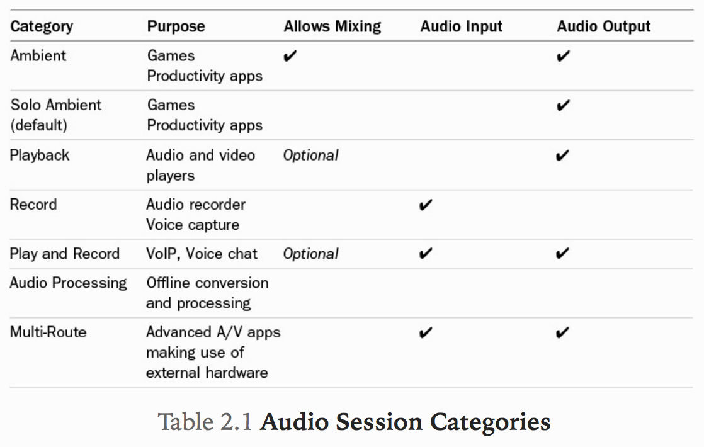
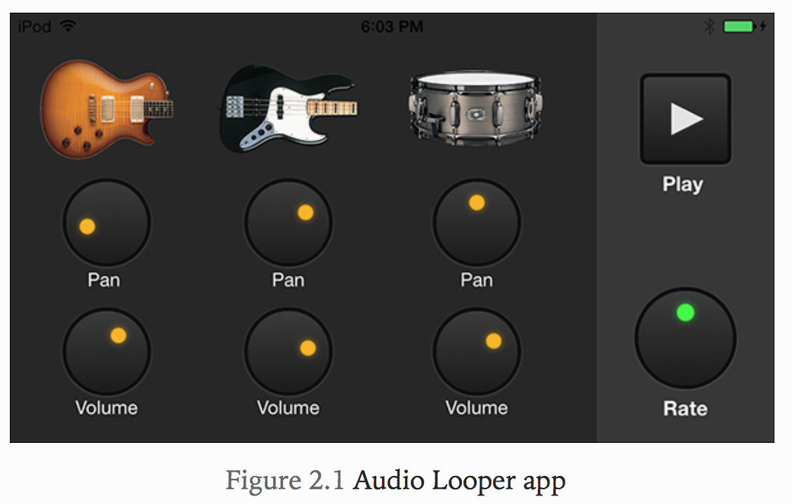
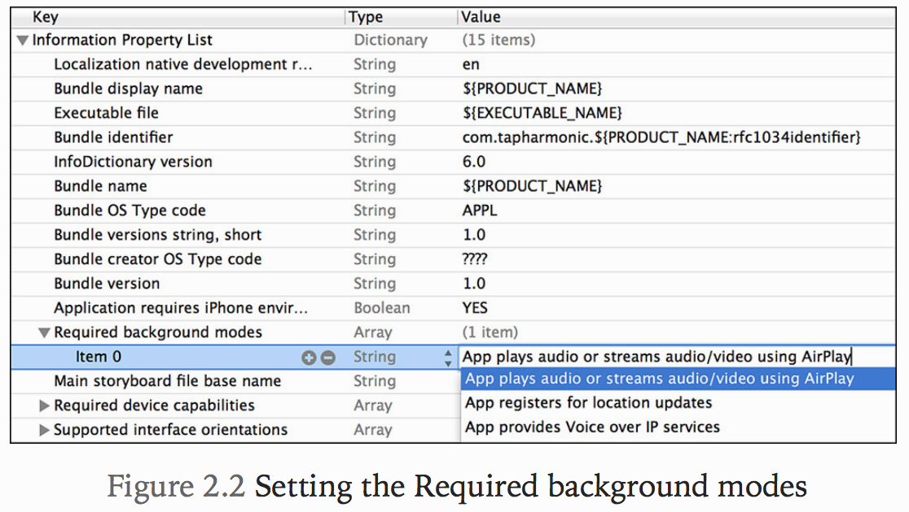
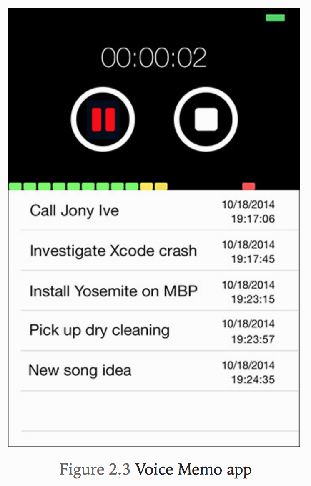
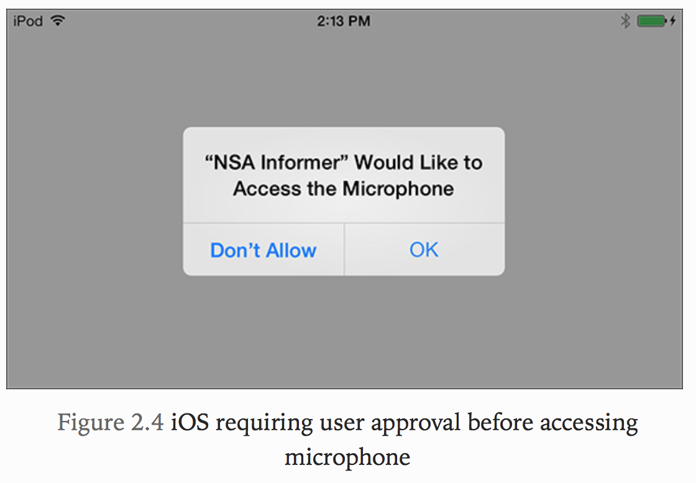

# 2. Playing and Recording Audio
 * AV Foundation은 오디오 전용 프레임 워크로서의 삶을 시작했습니다. iOS 2.2에서 소개 된 프레임 워크의 첫 번째 구체화에는 오디오 재생을 처리하는 단일 클래스가 포함되었습니다. iOS 3.0에서 Apple은 오디오 녹음 기능을 도입했습니다. 이러한 클래스는 프레임 워크에서 가장 오래된 클래스 중 일부이지만 여전히 가장 널리 사용되는 클래스입니다. 이 장에서는 AVAudioPlayer 및 AVAudioRecorder 클래스를 살펴보고 이러한 클래스를 활용하여 오디오 재생 및 레코드 기능을 응용 프로그램에 추가하는 방법을 살펴 봅니다.

## Mac and iOS Audio Environments
* 오디오 재생 및 녹음에 대한 논의를 시작하기 전에 Mac 및 iOS 플랫폼의 오디오 환경을 고려해야합니다. Mac의 오디오 환경은 매우 자유롭고 유연하며 주로 사용자의 통제하에 있습니다. GarageBand에서 iTunes에서 음악을 재생하고, QuickTime 동영상을보고, 인터넷을 통해 오디오를 스트리밍하고, 기타 리프를 녹음 할 수 있습니다. 이것은 느낌적인 과부하를 거의 확실하게 초래할지라도, OS X는 실행할 수 있습니다. 하드웨어 및 소프트웨어를 능동적으로 관리하여 오디오 사용자 환경을 관리하는 데 수동적인 역할을합니다.
* 일반적인 시나리오를 고려하여 iOS와 대조해 보겠습니다.
  * iPhone에서 노래를 듣기 시작하고 오디오가 내장 스피커를 통해 재생되면 전화가 걸립니다. 노래가 빠르게 사라지고 재생이 일시 중지되고 벨소리가 들리기 시작합니다. TPS 보고서에 커버 시트를 넣었는지 확인하기 위해 사장님이 전화를하므로 전화 거절을 결정합니다. 오디오가 다시 페이드 인하면서 노래가 다시 재생되기 시작합니다. 이제 iPhone의 내장 스피커가 고전적인 `Parliament-Funkadelic` 트랙에 대한 정의를하지 못한다는 것을 알게되므로 헤드폰을 연결하십시오. 오디오 출력은 트랙이 계속 재생되는 동안 헤드폰으로 보내집니다. 청취가 끝나면 헤드폰을 분리하면 오디오 신호가 내장 스피커로 자동 경로 지정되고 재생이 일시 중지됩니다.
* 기술 수준에서는 설명 된 시나리오에서 많은 복잡성이 있지만 사용자의 관점에서 볼 때 단순한 마술 일뿐입니다. iOS는 전반적인 iOS 사용자 경험의 아름다움을 더하는 관리 오디오 환경을 제공하지만 이 마법은 정확히 어떻게 발생할까? 이 동작은 오디오 세션을 사용하여 가능합니다.

## Understanding Audio Sessions
* 오디오 세션은 앱과 운영 체제 사이의 중개자 역할을합니다. OS와 오디오 통신이 어떻게 이루어지는 지 간단하고 세련된 방식으로 알려줍니다. 오디오 하드웨어와의 구체적인 상호 작용을 자세히 설명하는 대신, 의미론적으로 앱의 동작을 설명합니다. 이를 통해 앱의 일반적인 오디오 동작을 표시하고 이 동작의 관리를 오디오 세션에 위임 할 수 있으므로 OS가 사용자의 오디오 환경을 가장 잘 관리 할 수 있습니다.
* 모든 iOS 응용 프로그램은 오디오 세션을 사용하는지 여부에 관계없이 오디오 세션을 보유합니다. 기본 오디오 세션은 다음과 같은 동작으로 사전 구성됩니다.
 * 오디오 재생은 활성화되었지만 오디오 녹음은 허용되지 않습니다.
 * 사용자가 벨소리 / 무음 스위치를 "무음"모드로 전환하면 응용 프로그램에서 재생되는 모든 오디오가 음소거됩니다.
 * 장치의 잠금 화면이 표시되면 응용 프로그램의 오디오가 음소거됩니다.
 * 응용 프로그램에서 오디오를 재생하면 배경에서 재생되는 다른 모든 오디오는 음소거됩니다.

* 기본 오디오 세션은 많은 유용한 동작을 제공하지만 응용 프로그램에 올바른 동작인지 확인하는 것이 중요합니다. 기본 동작은 다양한 응용 프로그램에서 제대로 작동하지만 미디어 응용 프로그램을 개발할 때 거의 필요하지 않습니다. 다행히도 오디오 세션은 카테고리를 사용하여 우리의 특별한 요구에 맞추기 쉽습니다.

## Audio Session Categories
* AV Foundation은 응용 프로그램에서 제공하는 오디오 동작을 설명하는 데 사용되는 7 가지 범주를 정의합니다. 표 2.1에는 사용 가능한 범주와 관련 목적 및 동작이 나열되어 있습니다.


* 애플리케이션에 적합한 카테고리를 결정할 때 핵심 동작에 대해 몇 가지 질문을해야합니다. 오디오 재생이 필수적입니까 아니면 주변 기능입니까? 응용 프로그램의 오디오를 배경 오디오와 믹스 할 수 있습니까? 응용 프로그램이 네트워크를 통해 녹음하거나 보내려면 오디오 입력을 캡처해야합니까? 응용 프로그램의 필수 오디오 동작을 결정한 후에는 적절한 범주를 쉽게 선택할 수 있습니다.
* 카테고리에서 제공하는 일반적인 동작은 대부분의 응용 프로그램에서 충분하지만 더 세부적인 제어가 필요한 경우 옵션 및 모드를 사용하여 일부 범주를 추가로 사용자 정의 할 수 있습니다. 옵션을 사용하면 응용 프로그램이 재생 범주를 사용하여 오디오 출력과 백그라운드에서 오디오 재생을 혼합 할 수 있는지 여부와 같이 범주에서 제공하는 선택적 동작을 활성화 할 수 있습니다. 모드는 매우 특정한 유스 케이스에 맞는 동작을 도입하여 카테고리를 추가로 수정합니다. VoIP 및 비디오 채팅 응용 프로그램은 자주 모드를 사용하여 필요한 동작을 얻지 만 동영상 재생 및 응용 프로그램 기록에도 유용한 동작을 제공하는 모드가 있습니다.

## Configuring an Audio Session
* 오디오 세션을 구성하는 방법의 예를 살펴 보겠습니다. 오디오 세션은 응용 프로그램이 끝날 때까지 수정할 수 있지만 일반적으로 응용 프로그램을 시작하면 한 번 구성됩니다. 이 구성을 수행하기에 좋은 곳은 애플리케이션 : didFinishLaunchingWithOptions : 메소드입니다. 애플리케이션 위임 내에 있습니다.

```Swift
func application(_ application: UIApplication, didFinishLaunchingWithOptions launchOptions: [UIApplicationLaunchOptionsKey: Any]?) -> Bool {
    // Override point for customization after application launch.
        
    let session = AVAudioSession.sharedInstance()
        
    do {
        try session.setCategory(AVAudioSessionCategoryPlayback)
        try session.setActive(true)
    } catch (let e) {
        print(e.localizedDescription)
    }
        
    return true
}
    
```

* AVAudioSession은 응용 프로그램의 오디오 세션과 상호 작용할 수있는 인터페이스를 제공하므로 싱글 톤 인스턴스에 대한 포인터를 가져 오는 것으로 시작합니다. 적절한 범주를 설정하여 특히 오디오 재생에 맞게 조정 된 오디오 세션을 지정합니다. 마지막으로 오디오 세션에이 구성을 활성화하도록 지시합니다.
* 이 장의 뒷부분에서 AVAudioSession을 사용하여 작업하는 방법에 대해 자세히 알아보고 오디오 재생에 대해 설명하겠습니다.

## Audio Playback with AVAudioPlayer
* AVAudioPlayer라는 클래스 덕분에 AVFoundation은 이 기능을 쉽게 구현할 수 있습니다. 이 클래스의 인스턴스는 파일 또는 메모리에서 오디오 데이터를 재생하는 간단한 방법을 제공합니다. 단순한 인터페이스에도 불구하고 매우 기능적인 구성 요소이며 종종 Mac 및 iOS에서 오디오 재생을 구현하기위한 최상의 선택입니다.
* AVAudioPlayer는 Core Audio의 C 기반 오디오 대기열 서비스 위에 구축됩니다. 따라서 Audio Queue Services에서 재생, 루핑 및 오디오 미터링과 같은 핵심 기능을 제공하지만 보다 간단하고 친숙한 Objective-C 인터페이스를 제공합니다. 네트워크 스트림에서 오디오를 재생하거나 원시 오디오 샘플에 액세스해야하거나 매우 낮은 대기 시간이 필요한 경우가 아니면 AVAudioPlayer를 사용하십시오.

## Creating an AVAudioPlayer
* AVAudioPlayer는 재생할 오디오의 메모리 내 버전 또는 로컬 오디오 파일에 대한 NSURL을 포함하는 NSData를 사용하여 두 가지 방식으로 구성 할 수 있습니다. iOS를 사용하는 경우 URL은 애플리케이션의 샌드박스 내에 위치하여야하며, 추가적으로 사용자의 iPod 라이브러리에있는 항목의 URL 일 수 있습니다. 예를 살펴 보겠습니다.

```Swift
if let fileURL = Bundle.main.url(forResource: "rock", withExtension: "mp3"), let player = try? AVAudioPlayer(contentsOf: fileURL) {
    player.prepareToPlay()
}
```

* 이 예에서는 애플리케이션 번들에 포함 된 "rock.mp3"을 가리키는 URL에서 AVAudioPlayer의 인스턴스를 만듭니다. 유효한 플레이어 인스턴스가 반환되면 prepareToPlay 메서드를 호출하는 것이 좋습니다. 이렇게하면 필요한 오디오 하드웨어를 가져오고 오디오 대기열의 버퍼를 미리로드합니다. prepareToPlay를 호출하는 것은 선택 사항이며 play 메서드가 호출 될 때 암시 적으로 호출되지만 생성시 플레이어를 준비하면 play 메서드를 호출 할 때와 오디오 출력을 청취 할 때의 대기 시간이 최소화됩니다.

## Controlling Playback
* 플레이어 인스턴스에는 재생을 제어 할 수있는 모든 메소드가 있습니다. 재생 메서드를 호출하면 현재시간에 오디오 재생이 시작되고 일시중지 메서드는 재생을 일시중지하고 중지메서드는 추측하여 재생을 중지합니다. 흥미롭게도, 일시정지와 정지방법은 모두 현재시간에 재생을 멈추게한다는 외견상 동일한 동작을합니다. 다음번에 play 메서드를 호출하면 두 작업 중 하나를 호출 한 후 재생이 중지되거나 일시중지 된 시점에 계속됩니다. 이러한 방법의 주요 차이점은 hood 입니다. stop 메소드를 호출하면 prepareToPlay에 대한 호출에 의해 수행 된 설정이 실행 취소되지만 일시 중지 호출에는 수행되지 않습니다.
* 앞서 설명한 표준 "전송"방법 외에도 다음과 같은 다른 흥미로운 작업을 수행 할 수도 있습니다.
 * 플레이어 볼륨 수정 : 플레이어의 볼륨은 시스템 볼륨과 독립적입니다. 오디오 페이드 적용과 같은 흥미로운 효과를 얻을 수 있습니다. 볼륨 또는 재생 이득은 0.0 (자동)에서 1.0 (최대 볼륨) 사이의 부동 소수점 값으로 정의됩니다.
 * 플레이어의 패닝을 수정하여 사운드를 스테레오 필드에 배치 할 수 있습니다. 팬 값은 -1.0 (하드 왼쪽)에서 1.0 (하드 오른쪽) 사이의 부동 소수점 값입니다. 기본값은 0.0 (가운데)입니다.
 * 재생 속도 조정 : iOS 5의 추가 기능으로 피치를 변경하지 않고도 재생 속도를 0.5 (1/2 속도)에서 2.0 (2x 속도)까지 조정할 수 있습니다. 복잡한 음악이나 구어체 단어를 옮겨 쓰는 경우 속도가 느릴 수 있으며 빠른 속도는 정부 규정 세미나를 빨리 통과하는 좋은 방법입니다.
 * numberOfLoops 속성을 설정하여 오디오를 끊김없이 반복 할 수 있습니다.이 속성을 양수로 설정하면 플레이어가 n 번 반복됩니다. 또는 값을 -1로 지정하면 플레이어가 무한정 반복됩니다.
 * 오디오 루핑은 압축되지 않은 선형 PCM 오디오와 AAC와 같은 압축 오디오 포맷을 사용하여 수행 할 수 있습니다. MP3 클립의 Gapless looping은 가능하지만 MP3 형식은 루핑 형식으로 악명 높습니다. MP3는 일반적으로 특수 도구를 사용하여 반복 목적으로 특별히 준비해야합니다. 압축 된 형식을 사용하려는 경우 AAC 또는 Apple Lossless와 같은 형식을 사용하는 것이 좋습니다.
 * 오디오 미터링 수행 : 재생할 때 플레이어에서 평균 및 최고 출력 수준을 읽을 수 있습니다. 이 데이터를 VU 미터 또는 기타 시각화 구성 요소에 공급하여 사용자에게 추가적인 시각적 피드백을 제공 할 수 있습니다. 이 장의 뒷부분에서 오디오 녹음에 관해 논의 할 때이 주제에 대해 살펴 보겠습니다.
* 보시다시피, 사용하기 쉬운 인터페이스에도 불구하고 AVAudioPlayer는 매우 유능한 클래스이며 오디오 재생을 위해 가장 먼저 돌아야합니다. AVAudioPlayer의 세부 사항을 살펴보고 이러한 기능을 실제로 볼 수 있습니다.

## Building an Audio Looper
* 이 섹션에서는 세 개의 플레이어 인스턴스의 재생을 동기화하고 각 플레이어의 볼륨 레벨을 제어하고 스테레오 필드 내에서 패닝하여 사운드를 함께 믹싱 할 수있는 오디오 루핑 응용 프로그램 (그림 2.1 참조)을 만들고 심지어 전반적인 재생 속도. AudioLooper_Starter라는 2장 디렉토리에서 시작 프로젝트를 찾을 수 있습니다.


* 이 샘플 앱은 다른 모든 책과 마찬가지로 사전 준비된 사용자 인터페이스를 갖추고 있으며 모든 작업 및 아웃렛이 유선으로 연결되어 있습니다. 오디오 플레이어를 관리하고 재생을 제어하는 코드는 THPlayerController라고하는 별도의 클래스에 포함되어 있으므로 AVFoundation 구현에 집중할 수 있습니다.

* init 부분
```Swift
class THPlayerController {
    var playing = false
    var players: [AVAudioPlayer?] = []
    
    init() {
        let guitarPlayer = playerForFile(name: "guitar")
        let basePlayer = playerForFile(name: "base")
        let drumsPlayer = playerForFile(name: "drums")
        
        players = [guitarPlayer, basePlayer, drumsPlayer]
    }
    
    func playerForFile(name: String) -> AVAudioPlayer? {
        if let fileURL = Bundle.main.url(forResource: name, withExtension: "caf"), let player = try? AVAudioPlayer(contentsOf: fileURL) {
            player.numberOfLoops = -1
            player.enableRate = true
            player.prepareToPlay()
            
            return player
        }
        
        return nil
    }
}
```

* play 구현 부분
```Swift
class THPlayerController {
    ...
    func play() {
      if !playing {
          let delayTime = players[0]?.deviceCurrentTime ?? 0 + 0.01
          for player in players {
              player?.play(atTime: delayTime)
          }

          playing = true
        }
    }
    ...
}
```

* 세 가지 플레이어 인스턴스의 재생을 동기화하려면 현재 장치 시간을 캡처하고 작은 지연을 추가하여 재생 시작시 공통 참조 시간을 갖기를 원할 것입니다. 플레이어의 배열을 반복하고 지연된 참조 시간을 전달하는 각 인스턴스에서 playAtTime :을 호출하여 재생을 시작합니다. 이렇게하면 오디오가 재생 될 때 이러한 플레이어가 긴밀하게 동기화 상태를 유지하게됩니다.

* stop 구현 부분
```Swift
class THPlayerController {
    ...
    func stop() {
        if playing {
            for player in players {
                player?.stop()
                player?.currentTime = 0.0
            }
            playing = false
        }
    }
    ...
}
```
* 중지 방법은 간단합니다. 오디오가 현재 재생중인 경우 플레이어 배열을 반복하고 각각에 대해 중지를 호출합니다. 또한 각 플레이어의 currentTime 속성을 0.0로 설정하여 재생 헤드를 시작 지점으로 되돌립니다. 마지막으로 재생 상태가 업데이트되어 재생이 중지되었음을 나타냅니다.

* adjustRate 구현 부분
```Swift
class THPlayerController {
    ...
    func adjustRate(rate: Float) {
        for player in players {
            player?.rate = rate
        }
    }
    ...
}
```

* 이제 전 세계적인 행동을 구현 했으므로 계속해서 앱을 실행하십시오. 세 개의 모든 플레이어가 완벽하게 동기화 된 상태에서 재생 및 재생을 중지하고 속도 조절기를 조정할 수 있습니다.

### Controlling the Individual Tracks
* 이 앱을 사용하면 각 플레이어의 볼륨과 패닝을 조정할 수 있습니다. 컨트롤은 유선이지만 현재 아무 것도하지 않으므로이 동작을 구현해 보겠습니다.

```Swift
class THPlayerController {
    ...
    func adjustPan(pan: Float, index: Int) {
        if isValidIndex(index: index) {
            let player = players[index]
            player?.pan = pan
        }
    }
    
    func adjustVolume(volume: Float, index: Int) {
        if isValidIndex(index: index) {
            let player = players[index]
            player?.volume = volume
        }
    }
    
    func isValidIndex(index: Int) -> Bool {
        return index == 0 || index < players.count
    }
    ...
}
```

* "adjust"메소드는 부동 소수점 조정 값과 수정할 플레이어를 식별하는 인덱스 값을 허용합니다. 팬 값은 -1.0 (하드 왼쪽)과 1.0 (하드 오른쪽) 사이이며 볼륨은 0.0 (자동)과 1.0 (최대 볼륨)의 범위입니다.
* Audio Looper 앱은 AVAudioPlayer 유틸리티의 좋은 예입니다. 복잡한 기능 집합을 구현했지만 그렇게 하기위한 간단한 코드를 작성했습니다. 기본 오디오 대기열 서비스를 사용하여 동일한 코드를 작성한 경우 손가락과 두뇌가 모두 지금 큰 고통을 겪을 것입니다.

### Configuring the Audio Session
* Audio Looper 앱은 지금까지 좋아 보이지만 더 큰 iOS 오디오 환경에서 제대로 재생되는지 몇 가지 테스트를 해보 죠. 앱을 아직 만들지 않았다면 앱을 만들어 기기에 배포하세요. 오디오 재생을 시작하고 장치 측면의 벨소리 / 무음 스위치를 토글하면 오디오 출력이 토글됩니다. 두 번째 테스트에서 오디오가 재생되는 동안 기기의 잠금 버튼을 누릅니다. 다시 오디오가 들리지 않는다는 것을 들을 수 있습니다. 응용 프로그램의 핵심 목적은 오디오를 재생하는 것이므로 이러한 동작은 사용자가 원하거나 필요로하지 않는 것입니다. 이것은 오디오 세션에 대한 주제로 돌아갑니다.
* 이전 섹션의 AVAudioSession에 대한 논의를 상기 해 보면 모든 iOS 애플리케이션에는 Solo Ambient라는 카테고리가있는 기본 오디오 세션이 자동으로 제공됩니다. 이 범주는 오디오 재생을 가능하게하지만 오디오 재생을 주 기능으로하는 응용 프로그램에는 적절한 범주가 아닙니다. 기본 범주는 원하는 동작을 제공하지 않으므로 오디오 세션을 명시 적으로 구성해야합니다. 오디오 세션은 일반적으로 응용 프로그램 시작시 한 번 구성 될 수 있으므로이 코드의 올바른 위치는 THAppDelegate의 응용 프로그램 : didFinishLaunchingWithOptions : 메소드에 있습니다. 아래는 Audio Looper의 오디오 세션을 올바르게 구성하는 방법을 보여 준다.

```Swift
class AppDelegate: UIResponder, UIApplicationDelegate {

    var window: UIWindow?


    func application(_ application: UIApplication, didFinishLaunchingWithOptions launchOptions: [UIApplicationLaunchOptionsKey: Any]?) -> Bool {
        // Override point for customization after application launch.
        
        let session = AVAudioSession.sharedInstance()
        
        do {
            try session.setCategory(AVAudioSessionCategoryPlayback)
            try session.setActive(true)
        } catch (let e) {
            print(e.localizedDescription)
        }
        
        return true
    }
}
```

* 오디오 세션이 제대로 구성된 상태에서 응용 프로그램을 장치에 다시 배포하고 테스트를 다시 실행하십시오. Ring / Silent 스위치를 토글 링하면 더 이상 오디오가 음소거되지 않는다는 것을들을 수 있습니다. 이 동작은 좋아 보이므로 장치를 잠그면 오디오가 계속 재생되는지 확인합시다. 잠금 버튼을 누르면 오디오가 계속 들리는 것을 알 수 있습니다. 문제가 있습니다. 이전과 동일한 동작이 계속 표시됩니다. 카테고리를 AVAudioSessionCategoryPlayback으로 설정하여이 문제를 해결하면 안됩니까? 대답은 '아니오'입니다. 이 카테고리를 설정하면 앱이 백그라운드에서 오디오를 재생할 수 있습니다. 기기가 잠겨있는 상태이지만 앱의 Info.plist를 약간 변경하여 명시 적으로 해당 동작을 선택해야합니다.
* Xcode Project Navigator 창에서 애플리케이션의 Info.plist 파일 (AudioLooper-Info.plist)을 찾아 Xcode의 속성 목록 편집기에서 엽니 다. Array 유형의 필수 백그라운드 모드라는 새 키를 추가하고이 배열에 App plays audio라는 새로운 항목을 추가하거나 AirPlay를 사용하여 오디오 / 비디오를 스트리밍합니다.

* 또는 Project Navigator에서 파일을 마우스 오른쪽 버튼으로 클릭하고 Open As> Source Code를 선택하여 plist를 XML로 모두 편집 할 수있다. 닫는 </ dict> 태그 앞에 파일의 맨 아래에 다음 항목을 추가하십시오.
```xml
<key>UIBackgroundModes</key>
<array>
    <string>audio</string>
</array>
```
* 이 설정을 추가하면 응용 프로그램에서 백그라운드에서 오디오를 재생할 수 있습니다. 앱을 다시 빌드하고 배포하고 재생을 시작하십시오. 이제 장치의 잠금 버튼을 다시 누르면 그루브가 백그라운드에서 계속 재생되는 것을들을 수 있습니다.

### Handling Interruptions
* 이제 Audio Looper 앱의 핵심 기능이 작동 했으므로 사용자 환경을 개선 할 방법을 고려해야 할 때입니다. 문제를 해결하는 가장 중요한 방법 중 하나는 인터럽션을 올바르게 처리하는지 확인하는 것입니다. 인터럽션은 iOS 기기에서 규칙적으로 발생합니다. 장치 사용 중에는 전화가 걸리고 알람이 울리며 FaceTime 요청이 나타납니다. iOS 자체는 이러한 이벤트를 처리하는 데 상당히 능숙하지만 이러한 조건에 대한 처리가 동등한 수준인지 확인해야합니다.
* Audio Looper 앱이 중단에 얼마나 잘 반응하는지 확인하기 위해 몇 가지 테스트를 수행해 보겠습니다. 테스트를 수행하려면 iPhone을 호출하거나 다른 iOS 장비 또는 Mac에서 FaceTime 요청을 시작할 수있는 다른 전화가 필요합니다. 다음 작업을 수행해 보겠습니다.
  1. 기기에서 앱을 실행하고 재생을 시작합니다.
  2. 오디오가 재생되는 동안 iPhone을 호출하거나 별도의 장치에서 FaceTime 요청을 시작하여 중단을 시작하십시오.
  3. 거부 버튼을 눌러 통화 또는 FaceTime 요청을 닫습니다.
* 이 테스트 시나리오를 실행할 수 있다면 몇 가지 흥미로운 행동을 관찰했습니다. 인터럽션이 시작되면 오디오 재생이 천천히 페이드 아웃되고 일시 중지됩니다. 그것은 코드를 작성하지 않고 자동으로 발생했습니다. 그러나 거부 버튼을 탭하고 중단을 종료하면 몇 가지 문제를보고들을 수 있습니다. 재생 / 중지 단추가 유효하지 않은 상태로 남았고 오디오 재생이 예상대로 재생되지 않았습니다. 분명히 이것은 바람직한 행동이 아니므로 이러한 문제를 해결할 수있는 방법을 살펴 보겠습니다.

### Audio Session Notifications
* 중단이 발생했을 때 조치를 취하기 전에 먼저 AVAudioSessionInterruptionNotification이라는 응용 프로그램의 AVAudioSession에서 게시 한 알림을 등록하여 발생 사실을 통지 받아야합니다. 컨트롤러의 init 메소드 안에이 통지를 위해 등록 할 것이다.

```Swift
class THPlayerController: NSObject {
    var playing = false
    var players: [AVAudioPlayer?] = []
    
    override init() {
        super.init()
        
        let guitarPlayer = playerForFile(name: "guitar")
        let basePlayer = playerForFile(name: "base")
        let drumsPlayer = playerForFile(name: "drums")
        
        players = [guitarPlayer, basePlayer, drumsPlayer]
        
        let nsnc = NotificationCenter.default
        nsnc.addObserver(self, selector: #selector(handelInterruption(notification:)), name: .AVAudioSessionInterruption, object: AVAudioSession.sharedInstance())
    }

    ...

    func handelInterruption(notification: Notification) {
        if let info = notification.userInfo, let type = info[AVAudioSessionInterruptionTypeKey] as? AVAudioSessionInterruptionType {
            switch type {
            case .began:
                // Handle AVAudioSessionInterruptionTypeBegan
            case .ended:
                // Handle AVAudioSessionInterruptionTypeEnded
            }
        }
    }
}
```

* 게시 된 알림에는 유용한 정보가 포함 된 채워진 userInfo 사전이 포함되어있어 취할 적절한 조치를 결정할 수 있습니다.
* handleInterruption : 메소드에서 AVAudioSessionInterruptionTypeKey의 값을 검색하여 인터럽트 유형을 결정합니다. 반환되는 값은 AVAudioSessionInterruptionType이며, 이는 인터럽트가 시작되었거나 종료되었는지를 나타내는 enum 타입입니다.
* 중단이 발생할 때 취할 조치 중 하나는 재생 / 중지 버튼과 관련 레이블의 상태를 올바르게 업데이트하는 것입니다. THPlayerController는 사용자 인터페이스를 관리하지 않으므로 이러한 중단 이벤트를 View Controller에 전달할 방법이 필요합니다.

```Swift
protocol THPlayerControllerDelegate {
    func playbackStopped()
    func playbackBegan()
}
```

* 응용 프로그램의 뷰컨트롤러는 이미 이 프로토콜을 채택하고 대리자로 설정됩니다. 이렇게하면 응용 프로그램의 사용자 인터페이스를 간단하고 깨끗하게 업데이트 할 수 있습니다. 이를 염두에두고, AVAudioSessionInterruptionTypeBegan 유형을 처리해 보겠습니다.

```Swift
class THPlayerController: NSObject {
    ...
    var delegate: THPlayerControllerDelegate?

    ...

    func handelInterruption(notification: Notification) {
        if let info = notification.userInfo, let type = info[AVAudioSessionInterruptionTypeKey] as? AVAudioSessionInterruptionType {
            switch type {
            case .began:
                delegate?.playbackStopped()
            case .ended:
                // Handle AVAudioSessionInterruptionTypeEnded
            }
        }
    }
}
```

* stop 메서드를 호출하고 playbackStopped 메서드를 호출하여 중단 상태를 대리자에 알립니다. 이 알림을 받으면 오디오 세션은 이미 비활성화되고 AVAudioPlayer 인스턴스가 일시 중지되었습니다. 컨트롤러 정지를 호출하는 효과는 재생을 중지하지 않고 내부 상태를 업데이트하는 것입니다.
* 인터럽션 유형이 `AVAudioSessionInterruptionTypeEnded`인 경우 userInfo 딕셔너리에 오디오 세션이 다시 활성화되고 재생이 다시 시작될 수 있는지 여부를 나타내는 `AVAudioSessionInterruptionOptions`값이 포함됩니다.

```Swift
class THPlayerController: NSObject {
    ...
    var delegate: THPlayerControllerDelegate?

    ...

    func handelInterruption(notification: Notification) {
        if let info = notification.userInfo, let type = info[AVAudioSessionInterruptionTypeKey] as? AVAudioSessionInterruptionType {
            switch type {
            case .began:
                delegate?.playbackStopped()
            case .ended:
                if let options = info[AVAudioSessionInterruptionOptionKey] as? AVAudioSessionInterruptionOptions {
                    if options == .shouldResume {
                        play()
                        delegate?.playbackBegan()
                    }
                }
            }
        }
    }
}
```

* 옵션 값이 AVAudioSessionInterruptionOptionShouldResume과 같으면 컨트롤러의 play 메서드를 호출하고 해당 playbackBegan 메서드를 호출하여 대리자에 알립니다.
* 응용 프로그램을 다시 빌드하고 전개하고 인터럽트 테스트를 다시 실행하십시오. 이제 인터럽션이 시작되면 플레이어의 사용자 인터페이스가 제대로 업데이트됩니다. 제어가 응용 프로그램으로 돌아 오면 오디오 재생이 시작되고 모든 것이 양호한 상태입니다.

### Responding to Route Changes
* AVAudioPlayer의 적용 범위를 마무리하기 전에 해결해야 할 마지막 항목은 앱이 경로 변경에 올바르게 응답하는지 확인하는 것입니다. 경로 변경은 오디오 입력 또는 출력이 iOS 장치에 추가되거나 제거 될 때마다 발생합니다. 이 문제는 여러 가지 이유로 발생할 수 있습니다. 예를 들어 사용자가 헤드폰 세트를 꽂거나 USB 마이크를 분리하는 경우입니다. 이러한 이벤트가 발생하면 오디오 입력 및 출력이 이에 따라 경로가 변경되고 AVAudioSession은 관심있는 수신기의 변경 내용을 설명하는 알림을 브로드 캐스트합니다. Apple의 휴먼 인터페이스 가이드 라인 (HIG)에 정의 된 동작을 준수하기 위해 앱이 관심있는 청취자 중 하나가되어야합니다.
* Audio Looper 앱에 대해 다른 테스트를 해봅시다. 재생을 시작하고 오디오가 재생되는 동안 일련의 헤드폰을 연결하십시오. 오디오가 계속 재생되는 동안 오디오 출력은 헤드폰 잭으로 경로가 변경됩니다. 이는 정확히 우리가 기대하는 동작입니다. 오디오가 계속 재생되면 헤드폰을 분리하십시오. 이제 오디오가 내부 스피커로 되돌아 가고 오디오가 다시 들리기 시작합니다. 필요한 경우 라우팅 홉 (routing hap)이 페인팅되었지만 오디오는 Apple 지침에 따라 묵음 처리되어야합니다. 사용자가 헤드폰 세트를 꽂으면 오디오를 비공개로 설정하려는 암시가 있습니다. 즉, 오디오 재생을 중지하여 헤드폰을 뽑을 때 프라이버시를 존중해야합니다. 그래서, 어떻게 그 일을합니까?
* 라우팅 변경이 발생할 때 알림을 받으려면 AVAudioSessionRouteChangeNotification이라는 AVAudioSession에서 게시 한 알림을 등록해야합니다. 이 알림에는 이전 라우팅 설명뿐만 아니라 알림이 게시 된 이유를 나타내는 이유가 포함 된 채워진 userInfo 사전이 포함되어 있으므로 라우팅 변경 내용을 확인할 수 있습니다.
이러한 변경 사항을 통지 받기 전에 알림을 등록해야합니다. 인터럽트 알림을 등록 할 때처럼 당신은 THPlayerController의 init 메소드에서이 등록을 설정할 것이다.

```Swift
class THPlayerController: NSObject {
    ...

    override init() {
        super.init()

        ...

        nsnc.addObserver(self, selector: #selector(handleRouteChange(notification:)), name: .AVAudioSessionRouteChange, object: AVAudioSession.sharedInstance())
    }

    ...
}
```

* 이 통지를받는 첫 번째 일은 발생한 이유를 확인하는 것입니다. `AVAudioSessionRouteChangeReasonKey` 아래 userInfo 사전에 저장된 이유 값을 조회합니다. 반환 된 값은 변경 이유를 나타내는 부호없는 `정수`입니다. 그 이유는 새로운 장치가 부착되거나 오디오 세션 범주가 변경되는 등의 다양한 이벤트를 나타낼 수 있지만, 관찰하려는 특정 이벤트는 헤드폰이 뽑혀있는 경우입니다. 이 이벤트를 관찰하기 위해 `AVAudioSessionRouteChangeReasonOldDeviceUnavailable`이라는 이유를 보게 될 것입니다.

```Swift
class THPlayerController: NSObject {
    ...

    func handleRouteChange(notification: Notification) {
        if let info = notification.userInfo, let type = info[AVAudioSessionRouteChangeReasonKey] as? AVAudioSessionRouteChangeReason {
            switch type {
            case .oldDeviceUnavailable:
                if let previousRoute = info[AVAudioSessionRouteChangePreviousRouteKey] as? AVAudioSessionRouteDescription {
                    let previousOutput = previousRoute.outputs[0]
                    let portType = previousOutput.portType
                    if portType == AVAudioSessionPortHeadphones {
                        stop()
                        delegate?.playbackStopped()
                    }
                }
            default:
                break
            }
        }
    }
}
```

* 장치가 분리되었다는 것을 알게되면 userInfo 사전에 이전 경로를 설명하는 AVAudioSessionRouteDescription을 제공하도록 요청할 것입니다. 경로 설명은 입력의 NSArray와 출력의 NSArray로 구성됩니다. 이 배열에 포함 된 요소는 다양한 I / O 포트의 속성을 설명하는 AVAudioSessionPortDescription의 인스턴스입니다. 이 경우 경로 설명에서 첫 번째 출력 포트를 찾고 헤드폰 포트인지 확인합니다. 그렇다면 재생을 중지하고 대리자에서 playbackStopped 메서드를 호출합니다.
* 기기의 최신 변경 사항을 빌드 및 배포하고 새로운 동작을 테스트합니다. 이제 헤드폰을 분리하면 사용자가 기대하는 것처럼 오디오 재생이 중지됩니다.
경로 변경을 처리하고 중단에 적절하게 대응하는 것은 미디어 애플리케이션을 구축 할 때 항상 고려해야 할 중요한 사항입니다. 이러한 시나리오를 올바르게 처리하기위한 약간의 노력은 사용자가 좋아할만한 경험을 제공하는 데 많은 도움이됩니다.
이제 Audio Looper가 완성됨에 따라 AVAudioPlayer의 AVAudioRecorder에 주목할 차례입니다.

## Audio Recording with AVAudioRecorder
* AVAudioPlayer 클래스를 사용하여 AV Foundation에서 앱에 오디오 재생 기능을 추가하는 것이 얼마나 쉬운 지 보았습니다. AV Foundation을 사용하면 AVAudioRecorder 클래스를 사용하여 오디오 녹음 기능을 쉽게 추가 할 수 있습니다. AVAudioRecorder는 오디오 재생과 마찬가지로 Audio Queue Services를 기반으로 제작되었으므로 간단하면서도 사용하기 쉬운 Objective-C 인터페이스에서 많은 이점을 제공합니다. 이 클래스를 사용하여 Mac 또는 iOS 장비의 내장 마이크에서 녹음 할 수있을뿐 아니라 디지털 오디오 인터페이스 또는 USB 마이크와 같은 외부 오디오 장비에서 녹음 할 수도 있습니다.

## Creating an AVAudioRecorder
* 다음 세 가지 데이터를 제공하여 AVAudioRecorder의 인스턴스를 만듭니다.
 * 오디오 스트림이 기록 될 파일을 식별하는 로컬 파일 URL.
 * 녹음 세션을 구성하는 데 사용되는 키와 값을 포함하는 NSDictionary입니다.

 ```Swift
 let directory = ""  //  output directory
        let filePath = directory + "/voice.m4a"
        let url = URL(fileURLWithPath: filePath)
        let settings: [String: Any] = [AVFormatIDKey: kAudioFormatMPEG4AAC, AVSampleRateKey: 22050.0, AVNumberOfChannelsKey: 1]
        
        let recorder = try? AVAudioRecorder(url: url, settings: settings)
        recorder?.prepareToRecord()
 ```

* AVRecorder의 인스턴스를 성공적으로 생성하면 prepareToRecord 메서드를 호출하는 것이 좋습니다. 이는 AVPlayer의 prepareToPlay 메소드와 유사하여 기본 Audio Queue의 필요한 초기화를 수행합니다. 또한 녹음이 시작될 때 대기 시간을 최소화하기 위해 URL 인수로 지정된 위치에 파일을 추가로 만듭니다.
설정 사전에 지정된 키와 값은 일부 논의를 보증합니다. 정의 할 수있는 유효한 키 세트는 <AVFoundation / AVAudioSettings.h>에 있습니다. 대부분의 키는 특정 형식에만 적용되지만 다음은 모든 오디오 형식에 공통적입니다.

### Audio Format
* AVFormatIDKey 키는 기록 할 오디오 형식을 정의합니다. 다음과 같은 상수는 오디오 형식의 값으로 지원됩니다.

 * kAudioFormatLinearPCM
 * kAudioFormatMPEG4AAC
 * kAudioFormatAppleLossless
 * kAudioFormatAppleIMA4
 * kAudioFormatiLBC
 * kAudioFormatULaw

* kAudioFormatLinearPCM를 지정하면 압축되지 않은 오디오 스트림이 파일에 기록됩니다. 이 형식은 최상의 충실도를 제공하지만 가장 큰 파일 크기를 가져옵니다. AAC (kAudioFormatMPEG4AAC) 또는 Apple IMA4 (kAudioFormatAppleIMA4)와 같은 압축 형식을 선택하면 상당히 작은 파일이 만들어지며 여전히 고품질 오디오를 제공 할 수 있습니다.

```
Note
지정한 오디오 형식은 URL 인수에 정의 된 파일 형식과 호환되어야합니다. 예를 들어, test.wav라는 파일에 녹음하는 경우 녹음 된 오디오가 리니어 엔디안 인 WAVE (Waveform Audio File Format)에서 요구하는 형식 인 선형 PCM임을 암시 적으로 나타냅니다. AVFormatIDKey 값에 kAudioFormatLinearPCM 이외의 값을 지정하면 오류가 발생합니다. NSError에 localizedDescription을 요청하면 다음 오류 메시지가 반환됩니다.

작업을 완료 할 수 없습니다. (OS 상태 오류 1718449215).

오류 상태 1718449215는 호환되지 않는 오디오 형식을 정의했음을 나타내는 4 문자 코드 'fmt?'의 정수 값입니다.
```

## Sample Rate
* AVSampleRateKey는 레코더의 샘플링 속도를 정의하는 데 사용됩니다. 샘플링 속도는 들어오는 아날로그 오디오 신호의 초 당 취해진 샘플 수를 정의합니다. 샘플링 속도는 오디오 녹음의 품질과 결과 파일의 크기에 중요한 역할을합니다. 8kHz와 같은 낮은 샘플링 속도는 매우 거칠고 AM 라디오와 비슷한 녹음을하지만 파일 크기는 매우 작으며 44.1kHz 샘플링 속도 (CD 품질 샘플링)는 우수한 품질을 제공하지만 훨씬 더 큰 파일입니다. 요구 사항에 가장 적합한 샘플링 속도에 대한 확실한 답은 없지만 8,000, 16,000, 22,050 또는 44,100과 같은 표준 샘플링 속도를 고수해야합니다. 궁극적으로 귀가 판단하도록 해야합니다.

## Number of Channels
* AVNumberOfChannelsKey는 녹음 된 오디오 채널 수를 정의하는 데 사용됩니다. 기본값 1을 지정하면 모노 녹음이되고 2이면 스테레오 녹음이됩니다. 외부 하드웨어로 녹음하지 않는 한, 일반적으로 모노 녹음을 작성해야 함을 나타내야합니다.

## Format-Specific Keys
* 선형 PCM 또는 압축 된 오디오 형식으로 작업 할 때 추가 형식 별 키를 정의 할 수 있습니다. 전체 목록은 Xcode의 설명서 브라우저에서 "AV Foundation 오디오 설정 상수"참조를 참조하십시오.

## Controlling Recording
* 레코더의 유효한 인스턴스를 만든 후에는 새 레코딩을 시작할 수 있습니다. AVAudioRecorder는 무한 기간 동안 녹음하거나, 미래의 어떤 지점에서 녹음하거나, 특정 기간 동안 녹음 할 수있게 해주는 여러 가지 녹음 방법을 제공합니다. 녹음을 일시 중지했다가 다시 시작하여 중단 한 지점에서 녹음을 계속할 수도 있습니다. 이러한 유연성의 수준은 매우 편리하며 AVAudioRecorder는 Mac 및 iOS에서 많은 표준 녹음 요구 사항에 적합한 선택입니다.
* 이제는 AVAudioRecorder에 대해 전반적으로 이해 했으므로 간단한 음성 메모 응용 프로그램을 작성하여 이러한 기능을 실제로 볼 수 있도록하십시오.

## Building a Voice Memo App
* 음성 메모 앱 (그림 2.3 참조)을 사용하면 음성 메모를 녹음하고 진행중인 녹음을 일시 중지하며 재생할 수있는 메모 목록을 유지 관리 할 수 있습니다. 이 기본 기능을 작동시킨 후에는 사용자 환경을 더욱 향상시키는 두 가지 방법을 살펴 보겠습니다. VoiceMemo_Starter라는 2장 디렉토리에서 시작 프로젝트를 찾을 수 있습니다.


* 이 앱은 사전 구성된 사용자 인터페이스가 있지만 구현 된 기능은 없습니다. THRecorderController 클래스 내에서 핵심 레코딩 동작을 구현할 것입니다.하지만 그렇게하기 전에 레코딩을 사용하도록 오디오 세션을 올바르게 구성 해 봅시다.

### Audio Session Configuration
* 이 응용 프로그램의 주요 목적은 음성 메모를 녹음하고 재생하는 것입니다. 오디오 입력을 사용할 수 없으므로 Solo Ambient(AVAudioSessionCategorySoloAmbient)의 기본 범주가 작동하지 않습니다. 녹음 및 재생 기능이 모두 필요하므로 앱의 해당 카테고리는 `AVAudioSessionCategoryPlayAndRecord`입니다. THAppDelegate의 애플리케이션 위임에서 오디오 세션을 설정하여 목록 아래와 같이 이 카테고리를 사용하게된다.

```Swift
class AppDelegate: UIResponder, UIApplicationDelegate {

    var window: UIWindow?


    func application(_ application: UIApplication, didFinishLaunchingWithOptions launchOptions: [UIApplicationLaunchOptionsKey: Any]?) -> Bool {
        // Override point for customization after application launch.
        
        let session = AVAudioSession.sharedInstance()
        
        do {
            try session.setCategory(AVAudioSessionCategoryPlayAndRecord)
            try session.setActive(true)
        } catch (let e) {
            print(e.localizedDescription)
        }
        
        return true
    }

    ...
}
```

* iOS 7부터는 운영 체제에서 사용자가 마이크를 사용하기 전에 앱에 명시 적으로 권한을 부여해야합니다. 앱이 마이크에 액세스하려고하면 운영 체제는 사용자에게 그림 2.4와 같은 대화 상자를 표시합니다.


* 사용자가 허용하지 않음 버튼을 누르면 시도 된 녹음은 아무 소리도 녹음하지 않습니다. 나중에 사용자가 마음을 바꾸고 애플리케이션 기록을 허용하려면 설정 앱의 개인 정보 > 마이크 설정에서 변경해야합니다.
* 이제 오디오 세션이 구성되었으므로 레코더 기능을 구현하십시오.

### Recorder Implementation
```Swift
import AVFoundation

typealias THRecordingStopCompletionHandler = () -> Bool
typealias THRecordingSaveCompletionHandler = () -> (Bool, Any)

class THRecorderController: NSObject {
    var player: AVAudioPlayer?
    var recorder: AVAudioRecorder?
    var completionHandler: THRecordingStopCompletionHandler?
    
    override init() {
        super.init()
        
        let tmpDir = NSTemporaryDirectory()
        let filePath = tmpDir + "/memo.caf"
        let fileURL = URL(fileURLWithPath: filePath)
        let settings: [String: Any] = [
            AVFormatIDKey: kAudioFormatAppleIMA4,
            AVSampleRateKey: 44100.0,
            AVNumberOfChannelsKey: 1,
            AVEncoderBitDepthHintKey: 16,
            AVEncoderAudioQualityKey: AVAudioQuality.medium.rawValue
        ]
        
        recorder = try? AVAudioRecorder(url: fileURL, settings: settings)
        recorder?.delegate = self
        recorder?.prepareToRecord()
    }
}

extension THRecorderController: AVAudioRecorderDelegate {
    
}
```

* THRecorderController.swift 파일에서 AVAudioRecorderDelegate 프로토콜을 사용하는 클래스 확장을 정의합니다. 레코더의 위임 프로토콜은 레코딩이 완료되었을 때 알림을받을 수있는 방법을 정의합니다. 녹음이 완료되었음을 알면 사용자가 녹음을 이름 지정하고 저장할 수있는 기회를 가질 수 있습니다.
* init 메소드를 사용하면 레코더 구성을 수행 할 수 있습니다. tmp 디렉토리에 memo.caf라는 파일을 기록합니다. Core Audio Format (CAF)은 컨텐트에 무관심하며 Core Audio에서 지원하는 모든 오디오 형식을 포함 할 수 있으므로 녹음 할 때 가장 적합한 컨테이너 형식입니다. 44.1kHz의 샘플 속도, 16 비트의 비트 심도 및 단일 모노 채널을 사용하여 Apple IMA4를 오디오 형식으로 사용하도록 녹음 설정을 정의합니다. 이러한 설정은 품질과 파일 크기의 균형이 잘 맞습니다.

```Swift
...

class THRecorderController: NSObject {
    ...

    var record: Bool {
        return recorder?.isRecording ?? false
    }
    
    func pause() {
        recorder?.pause()
    }
    
    func stopWithCompletionHandler(handler: @escaping THRecordingStopCompletionHandler) {
        completionHandler = handler
        recorder?.stop()
    }
}

extension THRecorderController: AVAudioRecorderDelegate {
    func audioRecorderDidFinishRecording(_ recorder: AVAudioRecorder, successfully flag: Bool) {
        completionHandler?(flag)
    }
}
```

* 이러한 메소드의 구현은 레코더 인스턴스에 위임하여 작업을 수행하기 때문에 간단합니다. 그러나 stopWithCompletionHandler : 약간의 설명이 필요합니다. 사용자가 중지 단추를 누르면이 메서드가 호출되고 완료 블록이 전달됩니다. 블록에 대한 참조를 저장 한 다음 레코더의 stop 메서드를 호출하면 레코더 인스턴스가 오디오 녹음을 마무리합니다. 오디오 녹음이 완료되면 레코더가 대리자 메서드를 호출합니다.이 시점에서 완성 블록을 실행하여 호출자에게 적절한 작업을 수행 할 수 있도록 알립니다. 이 경우 뷰컨트롤러는 사용자에게 경고를 표시하여 사용자가 이름을 지정하고 녹음을 저장할 수 있도록합니다. 아래의 save 연산을 살펴 보자.

```Swift
...

class THRecorderController: NSObject {
    ...

    var documentDirectory: String {
        let path = NSSearchPathForDirectoriesInDomains(.documentDirectory, .userDomainMask, true).first ?? ""
        return path
    }
    
    ...

    func saveRecordingWithName(name: String, handler: THRecordingSaveCompletionHandler) {
        let timestamp = Date.timeIntervalSinceReferenceDate
        let fileName = String(format: "%@-%f.caf", name, timestamp)
        
        let docsDir = documentDirectory
        let destPath = docsDir + "/\(fileName)"
        
        let destURL = URL(fileURLWithPath: destPath)
        if let srcURL = recorder?.url {
            do {
                try FileManager.default.copyItem(at: srcURL, to: destURL)
                handler(true, THMemo(memoWithTitle: name, url: destURL))
            } catch(let e) {
                handler(false, e)
            }
        }
    }
}

...

```

* 사용자가 기록을 중지하고 메모의 이름을 묻는 메시지가 표시되면보기 컨트롤러는 saveRecordingWithName : completionHandler : 메서드를 호출합니다. 이 방법은 tmp 디렉토리의 기록을 고유 한 파일 이름으로 Documents 디렉토리로 복사합니다. 복사 작업이 성공적이면 완료 블록을 호출하여 오디오 녹음의 이름과 URL이 포함 된 THMemo의 새 인스턴스를 전달합니다. 그런 다음보기 컨트롤러 코드는 THMemo 인스턴스를 사용하여 기록 된 메모 목록을 작성합니다.
* 이 시점에서 응용 프로그램을 빌드하고 실행하여 핵심 동작을 실제로 볼 수 있습니다. 녹음을 녹음, 일시 중지 및 계속할 수 있으며 녹음을 중지하고 목록에 저장할 수 있습니다. 누락 된 기능의 마지막 몇 가지를 살펴 보겠습니다.
메모 목록을 성공적으로 기록하고 작성할 수 있지만 현재는 메모를 재생할 수 없습니다. playbackMemo : 메소드를 정의했지만 아직이 기능을 구현하지 않았으므로 이제 그렇게하십시오. 우리는 옛 친구 인 AVAudioPlayer를 사용하여 재생 기능을 구현할 것이다.

```Swift
...

class THRecorderController: NSObject {
    ...

    func playbackMemo(memo: THMemo) -> Bool {
        player?.stop()
        do {
            player = try AVAudioPlayer(contentsOf: memo.url)
            player?.play()
            return true
        } catch {
            return false
        }
    }
}

...

```

* 먼저 기존 플레이어를 중지하여 시작합니다 (존재하는 경우). 그런 다음 THMemo에 저장된 URL로 새 AVAudioPlayer 인스턴스를 만들고 플레이어의 play 메서드를 호출합니다. 이 경우 초기화 오류는 무시하지만 프로덕션 코드는이 오류를보다 견고하게 처리해야합니다.
* 재생 동작이 작동하면 필요한 누락 된 기능의 마지막 비트가 시간 표시와 관련됩니다. 사용자 인터페이스에는 시간을 표시하는 레이블이 있지만 00 : 00 : 00에 영구적으로 고정되어 있습니다. 특히 매력적이지는 않습니다. AVAudioRecorder에는 사용자에게 시간 피드백을 제공하는 사용자 인터페이스를 쉽게 만들 수있는 currentTime 속성이 있습니다. 이 속성은 NSTimeInterval을 반환합니다. NSTimeInterval은 녹음 시작 후 현재 시간 (초)을 나타냅니다. 자체 NSTimeInterval은 사용자 인터페이스에 표시하기에 적합하지 않지만 조금 마사지하면 더 적절한 것을 만들 수 있습니다. formattedCurrentTime 메서드를 살펴 보겠습니다.

```Swift
...

class THRecorderController: NSObject {
    ...

    func formattedCurrentTime() -> String {
        let time = Int(recorder?.currentTime ?? 0)
        
        let hours = time / 3600
        let minutes = (time / 60) % 60
        let seconds = time % 60
        
        let format = "%02i:%02i:%02i"
        return String(format: format, hours, minutes, seconds)
    }
}

...

```

* 레코더에서 현재 시간을 묻는 것으로 시작합니다. 반환 값은 NSTimeInterval로 정의 된 double 유형입니다. 이중 정밀도에 관심이 없으므로 시간을 NSUInteger로 저장합니다. 그런 다음 현재 시간에서 사용 가능한시, 분 및 초를 계산하고 NSString을 HH : mm : ss 형식으로 작성합니다.
* 이것이 어떻게 사용되는지 궁금 할 수도 있습니다. 이 메서드는 프레젠테이션에 적합한 형식화 된 문자열을 반환하지만 단일 시점 일뿐입니다. 시간을 표시하는 디스플레이를 어떻게 업데이트합니까? 첫 번째 생각은 currentTime 속성에서 KVO (Key-Value Observing)를 사용하는 것입니다. AV Foundation에서 KVO를 자주 사용하더라도 AVAudioRecorder (및 AVAudioPlayer)로 작업 할 때는 currentTime 속성을 관찰 할 수 없기 때문에 작업하지 않습니다. 대신, NSTimer를 사용하여 일정한 간격으로 값을 폴링합니다. 아래는 매 30 초마다 폴링하는 새로운 NSTimer 인스턴스를 설정하는 애플리케이션의 MainViewController 클래스의 코드를 보여준다.

```Swift
class MainViewController: UIViewController {
    @IBOutlet weak var timeLabel: UILabel!
    
    var timer: Timer?
    let controller = THRecorderController()
    
    func startTimer() {
        timer?.invalidate()
        timer = Timer(timeInterval: 0.5, target: self, selector: #selector(updateDisplay), userInfo: nil, repeats: true)
        if let timer = timer {
            RunLoop.main.add(timer, forMode: .commonModes)
        }
    }
    
    func updateDisplay() {
        timeLabel.text = controller.formattedCurrentTime()
    }
}
```

* 응용 프로그램을 실행하고 새 녹음을 시작하십시오. 이제 시간 표시가 업데이트되어 녹음의 현재 시간을 보여줍니다. 일시 중지를 누르면 현재 시간에 일시 중지되고 다음에 녹음을 살짝 누르면 중단 된 위치에서 바로 시작됩니다. 이렇게하면 녹음이 진행 중임을 알리고 사용자가 녹음 한 시간을 알리는 멋진 피드백을 사용자에게 제공합니다. 시간 표시는 녹음이 진행 중임을 나타내는 표시이지만 실제로 녹음 된 내용이 있으면 사용자에게 알려주지 않습니다. 캡처되는 오디오 신호에 대한 시각적인 피드백을 제공하는 것이 좋습니다. 다행히도 미터링을 사용하면 그렇게 할 수 있습니다.

## Enabling Audio Metering
* AVAudioRecorder 및 AVAudioPlayer에서 사용할 수있는 강력하고 유용한 기능은 오디오 미터링을 수행하는 기능입니다. 오디오 미터링을 사용하면 평균 및 최대 전력 수준을 데시벨 단위로 읽고 데이터를 사용하여 사용자에게 오디오 수준에 대한 추가 시각적 피드백을 제공 할 수 있습니다.
* 두 클래스에서 사용할 수있는 메서드는 `averagePowerForChannel :` 및 `peak-PowerForChannel :` 입니다. 두 방법 모두 요청 된 전력 레벨을 나타내는 부동 소수점 값을 데시벨 (dB) 단위로 반환합니다. 값은 최대 전력을 나타내는 0dB 풀 스케일부터 최소 전력 레벨 또는 무음을 나타내는 -160dB까지 범위를 반환합니다.
* 이 값을 읽기 전에 먼저 레코더의 `meteringEnabled` 속성을 YES로 설정하여 미터링을 활성화해야합니다. 이를 통해 레코더는 캡처 된 오디오 샘플에 대한 전력 계산을 수행 할 수 있습니다. 값을 읽을 때마다 `updateMeters` 메소드를 호출하여 최신 판독 값을 가져와야합니다.
* 음성 메모 응용 프로그램에서 AVAudioRecorder 인스턴스에 대한 측광을 활성화하고 이 데이터를 사용하여 간단한 시각 측정기를 사용자에게 표시하려고합니다. `averagePowerForChannel :` 및 `peakPowerForChannel :` 메서드가 제공하는 판독 값은 데시벨 수준을 나타내는 부동 소수점 값을 반환하며 이는 전력 비율을 설명하는 대수 단위입니다. 샘플 애플리케이션에는 Quartz 기반의 레벨 미터보기가 있어 사용자가 녹화하는 동안 평균 및 최대 전력 수준을 표시하지만 이 뷰를 사용하기 전에 데시벨 값을 로그 눈금 -160에서 0으로 `0부터 1까지의 선형 스케일`로 변환합니다. 레벨 값을 요청할 때마다 이 변환을 수행 할 수 있습니다. 그러나 더 나은 해결책은 이러한 전환을 한 번 계산하고 필요에 따라 조회하는 것입니다. 샘플 애플리케이션에는 `THMeterTable`이라는 클래스가 있습니다. 이 클래스는 여러 가지 샘플 프로젝트에서 사용되는 Apple의 C ++ 기반 MeterTable 클래스의 단순화 된 Objective-C 포트입니다.

```Swift
class THMeterTable {
    let MIN_DB: Float = -60.0
    let TABLE_SIZE: Int = 300
    
    let meterTable: NSMutableArray
    let scaleFactor: Float
    
    init() {
        let dbResolution = MIN_DB / Float(TABLE_SIZE - 1)
        
        meterTable = NSMutableArray(capacity: TABLE_SIZE)
        scaleFactor = 1.0 / dbResolution
        
        let minAmp = dbToAmp(dB: MIN_DB)
        let ampRange = 1.0 - minAmp
        let invAmpRange = 1.0 / ampRange
        
        for i in 0..<TABLE_SIZE {
            let decibles = Float(i) * dbResolution
            let amp = dbToAmp(dB: decibles)
            let adjAmp = (amp - minAmp) * invAmpRange
            
            meterTable[i] = adjAmp
        }
    }
    
    func dbToAmp(dB: Float) -> Float {
        return powf(10.0, 0.05 * dB)
    }
    
    func valueForPower(power: Float) -> Float {
        if power < MIN_DB {
            return 0.0
        } else if power >= 0.0 {
            return 1.0
        } else {
            let index = Int(power * scaleFactor)
            return meterTable[index] as! Float
        }
    }
}
```

* 이 클래스는 사전 계산 된 데시벨 대 진폭 변환을 데시벨 수준의 분해능 (이 경우에는 -0.2dB)으로 저장하는 내부 배열을 만듭니다. 해상도 수준은 MIN_DB 및 TABLE_SIZE 값을 수정하여 조정할 수 있습니다.
* 각 데시벨 값은 0 (-60dB)에서 1 범위에 맞게 조정 된 dbToAmp 함수를 호출하여 선형 눈금으로 변환 된 다음 값 범위에 걸쳐 곡선을 부드럽게하기 위해 계산되고 내부 조회 테이블에 저장되는 제곱근을 가집니다. 그런 다음 필요할 때마다 valueForPower : 메소드를 호출하여 이러한 값을 검색 할 수 있습니다.
* THRecorderController 클래스로 돌아가서이 클래스를 사용하기 위해 다음과 같이 수정 해보자. 계량기 테이블을 보유 할 새 속성을 추가하고 init 메소드에서 새 계단식 인스턴스를 생성합니다.

```Swift
...

class THRecorderController: NSObject {
    ...

    var meterTable: THMeterTable?
    
    ...

    override init() {
        super.init()
        
        ...

        meterTable = THMeterTable()
    }

    ...
}
```

* 이제 레벨 반환을 위한 새로운 메소드를 추가 할 것입니다.

```Swift
...

class THRecorderController: NSObject {
  ...

  var levles: THLevelPair {
          recorder?.updateMeters()
          let avgPower = recorder?.averagePower(forChannel: 0) ?? 0
          let peakPower = recorder?.peakPower(forChannel: 0) ?? 0
          let linearLevel = meterTable?.valueForPower(power: avgPower) ?? 0
          let linearPeak = meterTable?.valueForPower(power: peakPower) ?? 0
        
          return THLevelPair(levelsWithLevel: linearLevel, peakLevel: linearPeak)
     }
}
```
* 레코더의 updateMeters 메서드를 호출하여이 메서드를 시작합니다. 레벨 값을 읽는 즉시이 메소드를 호출하여 레벨이 최신인지 확인해야합니다. 그런 다음 채널 0의 평균 및 최고 출력 레벨을 묻습니다. 채널의 인덱스는 0이며 모노로 녹음하기 때문에 첫 번째 채널을 요청합니다. 선형 전력 레벨을 측정기 테이블에 쿼리하고 마지막으로 THLevelPair의 새 인스턴스를 만듭니다. 이 클래스는 이미 샘플 프로젝트에 있습니다. 평균 및 최고 레벨 쌍을 반환하는 것은 단순한 가치 보유자입니다.
* 전원 수준을 읽는 것은 최신 값을 얻고 자 할 때마다 레코더를 폴링해야한다는 점에서 현재 시간을 요청하는 것과 유사합니다. 클라이언트 코드는 현재 시간을 요청할 때처럼 NSTimer를 사용할 수 있습니다. 그러나 애니메이션을 부드럽게 유지하기 위해 미터 디스플레이를 자주 업데이트해야하기 때문에 다른 해결책은 CADisplayLink를 사용하는 것입니다. CADisplayLink는 NSTimer와 유사하지만 자동으로 디스플레이의 재생 빈도와 동기화됩니다. MainViewController.swift을 열면 아래와 같은 메소드를 볼 수있다.

```Swit
class MainViewController: UIViewController {
    @IBOutlet weak var levelMeterView: MeterView!
    
    var levelTimer: CADisplayLink?
    let controller = THRecorderController()
    
    func startTimer() {
        levelTimer?.invalidate()
        
        levelTimer = CADisplayLink(target: self, selector: #selector(updateDisplay))
        levelTimer?.preferredFramesPerSecond = 5
        levelTimer?.add(to: RunLoop.current, forMode: .commonModes)
    }
    
    func stopMeterTimer() {
        levelTimer?.invalidate()
        levelTimer = nil
        levelMeterView.resetLevelMeter()
    }
    
    func updateDisplay() {
        let levels = controller.levels
        
        levelMeterView.level = levels.level
        levelMeterView.peakLevel = levels.peakLevel
        
        levelMeterView.setNeedsDisplay()
    }
}
```

* startLevelTimer 메서드가 호출되면 일정한 간격으로 updateLevelMeter 메서드를 호출하는 새로운 CADisplayLink 인스턴스를 만듭니다. 기본적으로 해당 간격은 새로 고침 빈도와 동기화되지만,이 경우 frameInterval 속성을 4로 설정하여 새로 고침 빈도를 1/4로 설정합니다. 이는 필요한 경우 충분합니다.
* updateLevelMeter 메서드는 THRecorderController에서 해당 수준을 쿼리하고 해당 수준을 levelMeterView에 제공 한 다음 setNeedsDisplay를 호출하여 뷰가 자체적으로 다시 칠하도록합니다.
* 응용 프로그램을 다시 빌드하고 실행하고 새 녹음을 시작하십시오. 레벨 미터는 목소리의 볼륨에 따라 디스플레이를 업데이트합니다. 이것은 메모가 실제로 기록되는 사용자에게 더 나은 시각적 피드백을 제공하기 때문에 응용 프로그램에 좋은 감동을 추가합니다.
* 미터 디스플레이와 미터링에 대해주의해야 할 것은 비용이 들게된다는 것입니다. 미터링을 사용하면 몇 가지 추가 계산이 수행되어 전력 소비에 영향을 줄 수 있습니다. 또한이 응용 프로그램의 레벨 미터 Quartz를 사용하여 작성된 것입니다. Quartz는 훌륭한 프레임 워크이지만 CPU가 바운드되어 있으므로 계측기를 연속적으로 다시 그리는 데 많은 비용이 듭니다. 응용 프로그램의 의도는 일반적으로 "식료품 점에서 우유를 가져 가라"또는 "다음 금요일에 Charlie와의 모임을 준비하십시오"라고 말하는 것보다 짧은 메모를 기록하는 것이므로이 CPU 비용은 아마도 큰 문제가되지 않을 것입니다. 그러나 오랜 시간 동안 오디오를 녹음하려는 경우 미터링을 비활성화하거나 OpenGL ES 사용과 같은보다 효율적인 그리기 방법으로 전환하는 것이 좋습니다.

## Summary
* 이 장에서는 AV Foundation의 오디오 전용 클래스에서 제공하는 많은 기능을 보았습니다. AVAudioSession은 응용 프로그램과 더 큰 iOS 오디오 환경 사이의 중개자를 제공합니다. 범주를 사용하여 응용 프로그램에서 사용할 수있는 동작을 의미 론적으로 정의 할 수 있으며 중단 및 라우팅 변경을 관찰 할 수있는 기능도 제공합니다. AVAudioPlayer 및 AVAudioRecorder는 오디오 재생 및 녹음 처리를 위한 간단하면서도 강력한 인터페이스를 제공합니다. 둘 다 Core Audio 프레임 워크의 힘을 기반으로하지만 녹음 및 재생 기능을 앱에 추가하는 훨씬 쉽고 빠른 방법을 제공합니다.
