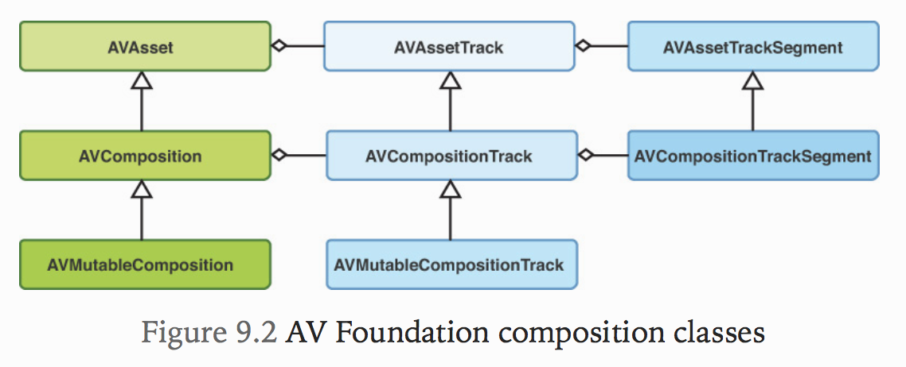
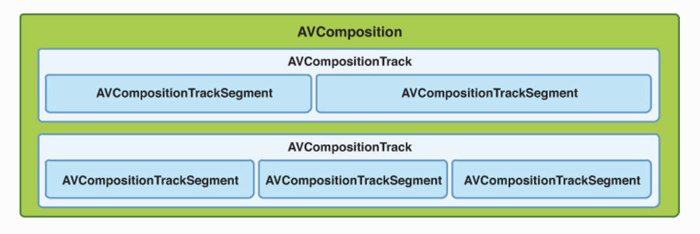

# 9. Composing and Editing Media
* 미디어 제작의 가장 중요한 부분은 post-production editing 작업임.
* AV Foundation은 비선형, 비파괴적인 편집 도구 및 응용 프로그램을 작성하기 위한 API를 제공함.
  * 비선형이라는 용어는 원하는 순서대로 미디어 클립을 결합, 분할, 자르기, 겹치기 및 재정렬 할 수 있음을 의미
  * 가장 중요한 부분은 이러한 편집 내용이 비파괴적이므로 원본 미디어가 변경되지 않고 계속 편집을 할 수 있다는 것임.

## Composing Media
* 많은 여행을 다니며 찍은 사진 및 영상들을 단일 영화같은 동영상으로 제작을 하고 싶어짐. 어떻게 해야할까?



* 위 사진을 이해해야함! 중요!
* AVFoundation의 구성 기능은 AVComposition이라는 AVAsset의 하위 클래스를 기반으로 함.
* 컴포지션은 다른 Media Asset을 custom temporal arrangement(뭐 사용자가 정의한 시간순같음)로 결합하여 단일 미디어 항목으로 만들하거나 처리할 수 있도록 함.
* AVAsset과 마찬가지로 컴포지션은 주어진 유형의 미디어 트랙을 하나 이상의 컨테이너로 사용함. AVComposition의 트랙은 AVCompositionTrack이라는 AVAssetTrack의 하위 클래스임.
* 컴포지션트랙 자체는 컴포지션의 실제 미디어 영역을 나타내는 AVCompositionTrackSegment 클래스로 정의되는 하나 이상의 미디어 세그먼트로 구성됨.

### 아.. 위의 그림으로 보기 힘드니 아래 그림으로 보자



* AVComposition은 AVAsset을 확장하므로 재생, 이미지 추출 또는 내보내기와 같은 일반 Asset을 사용하는 모든 시나리오에서 사용할 수 있음. 그러나 컴포지션은 약간 더 추상적인 용어로 간주되어야 함. AVAsset이 특정 미디어 파일에 직접 일대일 매핑을 하는 반면 컴포지션은 미디어의 여러 소스를 일괄적으로 제시하거나 처리하는 방법과 비슷함. 따라서 매우 가볍고 일시적인 객체로 자주 만들고 폐기할 수 있음.

```
Note
AVComposition은 NSCoding프로토콜을 따르지 않으므로 메모리 상태를 디스크에 저장이 불가능함. 따라서 편집용 프로그램을 제작하는 경우 이 상태를 유지하려면 사용자 지정 데이터 모델 클래스를 개발해야함.
```

* AVMutableComposition, AVMutableCompositionTrack이란 것이 있음. Mutable단어보면 얘네가 뭐하는지 알거라고 생각함.

## CMTime
* 애플에서는 미디어 시간으로 이것을 사용함 얘는 구조체이며 아래와 같이 생김.
```C
typedef struct {
    CMTimeValue value;
    CMTimeScale timescale;
    CMTimeFlags flags;
    CMTimeEpoch epoch;
} CMTime;
```
* CMTimeValue는 64비트 부호있는 정수, CMTimeScale은 32비트 부호있는 정수임. 
* CMTimeFlags는 뭐 불명확한 값을 체크할때 사용되는 비트마스크임.

### 3초를 나태는 CMTime을 만드는 방법
```Objectivec
CMTime t1 = CMTimeMake(3, 1);
CMTime t2 = CMTimeMake(1800, 600);
CMTime t3 = CMTimeMake(3000, 1000);
CMTime t4 = CMTimeMake(132300, 44100);
```

```
비디오로 작업할때 자주 사용하는 시간대는 600(24, 25 및 30FPS의 배수이기 때문), 오디오 데이터에서 가장 일반적으로 사용되는 시간대는 44,100, 48,000과 같은 샘플링 속도임.
```

## CMTimeRange
* 얘는 편집에서 중요한 역할을 하는 시간 범위 작업을 위한것임.
* 얘는 두개의 CMTime값으로 구성됨. 아래를 보면 암

```C
typedef struct {
   CMTime start;
   CMTime duration;
} CMTimeRange;
```

* AVURLAsset을 만들 때 options에 `AVURLAssetPreferPreciseDurationAndTimingKey`를 true로 하면 Asset의 정보가 `AVAsynchronousKeyValueLoading` 프로토콜을 사용하여 비동기로 로드될 때 정확한 지속시간과 타이밍이 계산됨.