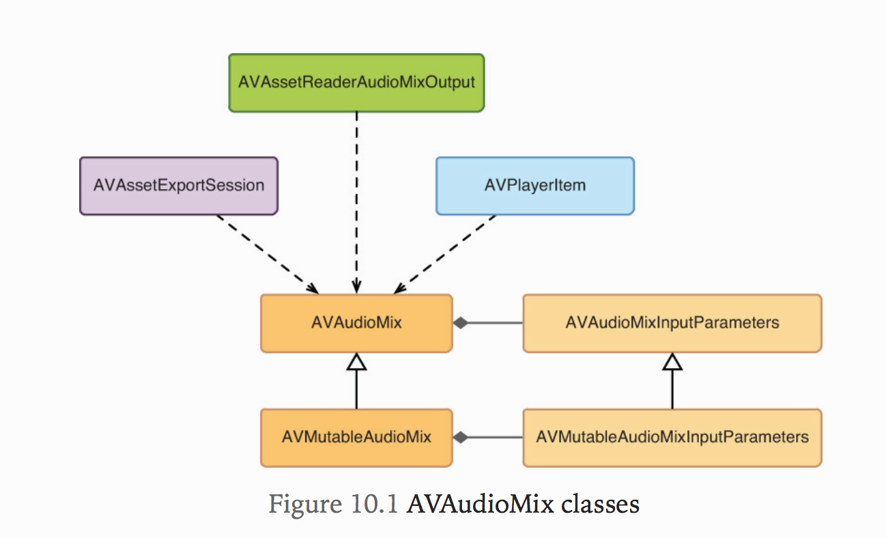
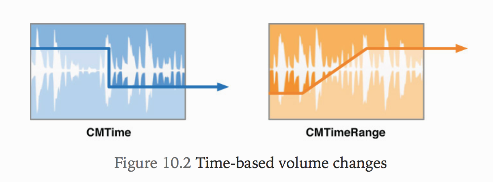
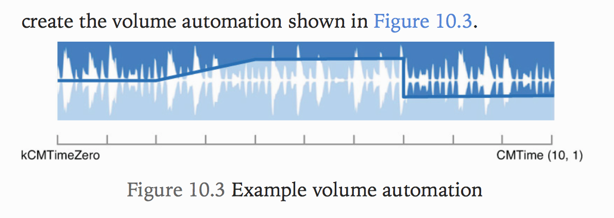

# 10. Mixing Audio
기본적인 오디오 믹싱을 수행하여 컴포지션의 오디오 측면을 개선하는 방법에 대해서 배울것임. 이번장은 매우 짧지만 오디오 출력의 품질을 크게 향상시키는데 도움이 될 것이다!

## Mixing Audio
볼륨조절때문에 어려운점이 많음. 보이스 오버가 켜졌을 때 음악 볼륨은 크기가 줄어들어야 하고, 보이스 오버가 켜졌을 때 다시 커져야 하는데 음악 재생때문에 보이스 오버가 들리지 않는 문제점이 있었음.
`AVAudioMix`를 사용하면 이것을 해결할 수 있음!



* AVAudioMix에 의해 수행되는 오디오 프로세싱의 속성은 `AVAudioMixInputParameters`라는 객체 형식으로 제공되는 입력 매개 변수 모음에 의해 정의됨.
* AVAudioMixInputParameters의 인스턴스는 컴포지션의 단일 오디오 트랙과 연결되며 오디오 믹스에 추가될 때 트랙에서 수행할 오디오 처리를 정의함.
* AVAudioMix 및 관련 컬렉션인 AVAudioMixInputParameters는 변경 불가능한 객체이므로 `AVPlayerItem` 및 `AVAssetExportSession`과 같은 클라이언트에 관련 데이터를 제공하는데 적합하지만, 상태를 조작할 수 있는 방법은 제공하지 않음.
* Custom Audio Mix를 만들 필요가 있을 때, `AVMutableAudioMix`와 `AVMutableAudioMixInputParameters`에 있는 가변적인 서브클래스를 사용하게 됨.

## Automating Volume Changes
* 오디오 믹스를 통해 적용할 수 있는 가장 기본적인 오디오 프로세싱은 컴포지션의 오디오 트랙의 볼륨 레벨을 조정하는 것임.
* 컴포지션의 오디오 소스가 단일이면, 재생 시 전체 또는 자연적인 볼륨으로 재생되지만 여러개의 오디오 소스가 포함되어 있는 경우 문제가 발생함.(여러개의 오디오 트랙이 있는 경우 각각의 볼륨이 공간을 차지하기 위해 경쟁을 함.)
* AVFoundation은 볼륨이 0.0에서 1.0사이의 정규화된 스케일에서 부동 소수점 값으로 정의되는 간단한 모델을 사용함.
* 오디오 트랙의 기본 볼륨은 1.0으로 설정되지만 `AVMutableAudioMixInputParameters` 인스턴스를 사용하여 수정할 수 있음.



위 그림에 묘사된 것과 같이 `AVMutableAudioMixInputParameters`는 볼륨 변경을 위한 두가지 방법을 제공함.

  * setVolume:atTime : 지정된 시간에 즉시 볼륨을 조정할 수 있음
  * setVolumeRampFromStartVolume:toEndVolume:timeRange : 주어진 시간 범위에 걸쳐 한 값에서 다른 값으로 볼륨을 부드럽게 램프할 수 있음.



위와 같은 볼륨의 변화를 위한 코드를 잠시 살펴보겠음.

```Objectivec
AVCompositionTrack *track = // audio track in composition

// Define automation times
CMTime twoSeconds = CMTimeMake(2, 1);
CMTime fourSeconds = CMTimeMake(4, 1);
CMTime sevenSeconds = CMTimeMake(7, 1);

// Create a new parameters object for the given audio track
AVMutableAudioMixInputParameters *parameters =
    [AVMutableAudioMixInputParameters audioMixInputParametersWithTrack:track];

// Set initial volume
[parameters setVolume:0.5f atTime:kCMTimeZero];

// Define time range of the volume ramp
CMTimeRange range = CMTimeRangeFromTimeToTime(twoSeconds, fourSeconds);

// Perform 2 second ramp from 0.5 -> 0.8
[parameters setVolumeRampFromStartVolume:0.5f toEndVolume:0.8f timeRange:range];

// Drop volume to 0.3 at the 7-second mark
[parameters setVolume:0.3f atTime:sevenSeconds];

// Create a new audio mix instance
AVMutableAudioMix *audioMix = [AVMutableAudioMix audioMix];

// Assign the input parameters to the audio mix
audioMix.inputParameters = @[parameters];
```

위 예제코드는 앞서 글들을 잘 이해했으면 쑥쑥 읽힐거라고 생각이 됨.

```
Note
AVAudioMix와 AVAudioMixInputParameters에 대해 AVComposition에서 오디오를 믹스하는 컨텍스트 뿐 만 아니라 AVAudioMixInputParameters의 인스턴스는 AVAssetTrack과 연결되어 특정 AVAsset의 오디오 트랙에 볼륨 조정을 정의할 수 있으므로, 특정 재생 및 내보내기 시나리오에서 유용할 수 있음.
```

## Summary
이 장에서는 AVAudioMix 및 AVAudioMixInputParameters를 사용하여 컴포지션의 오디오 트랙을 보다 잘 제어하는 방법을 배웠음. 오디오 믹싱은 모든 오디오 또는 비디오 편집 응용 프로그램에서 필수적인 기능이지만 AVComposition의 거의 모든 용도가 AVAudioMix를 사용하여 오디오 출력을 향상시킬 수 있음을 알게되었다!