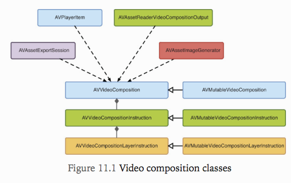
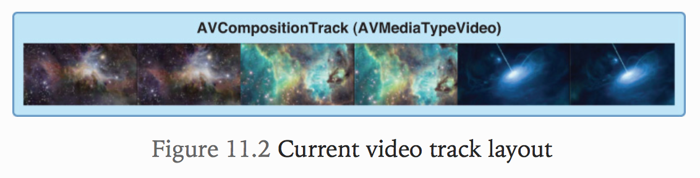
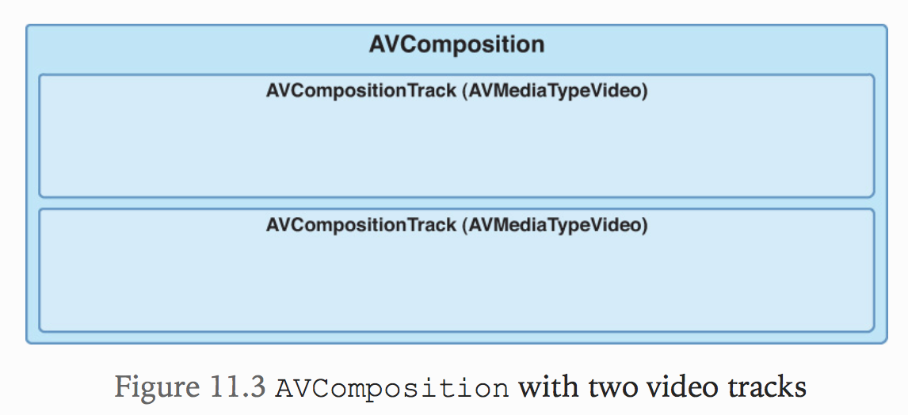
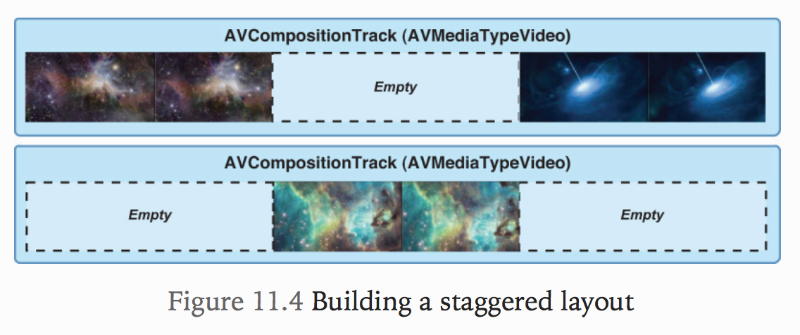
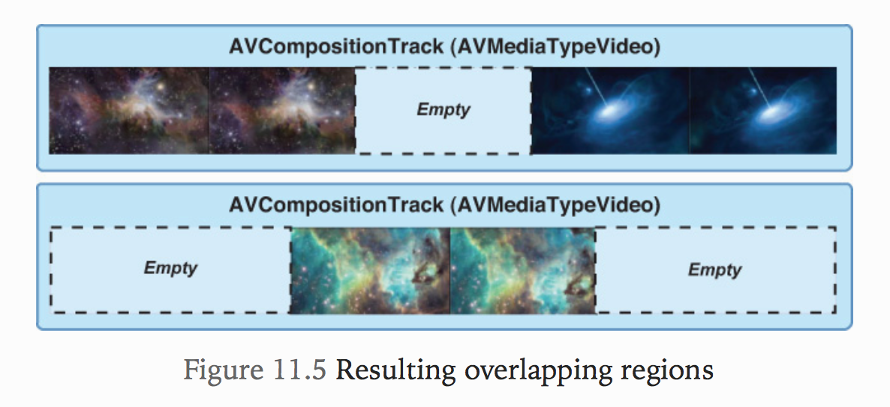
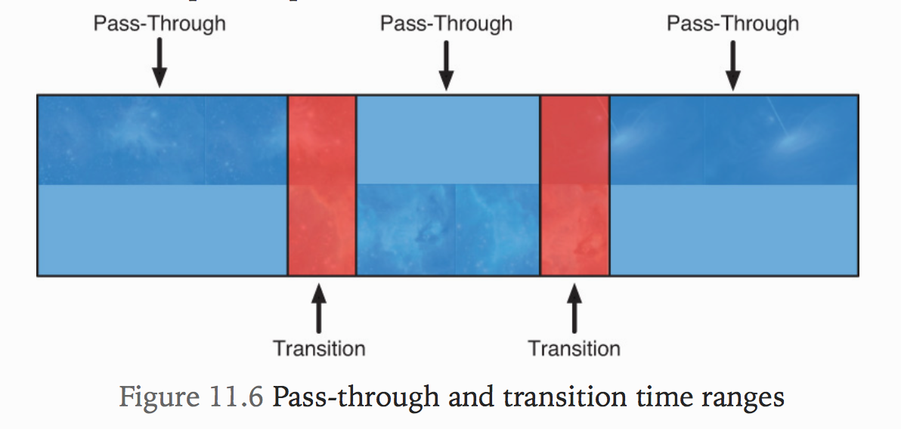
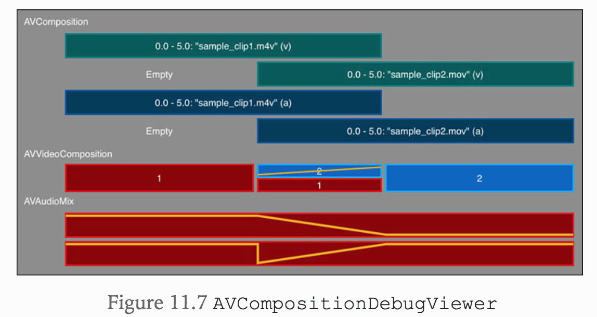
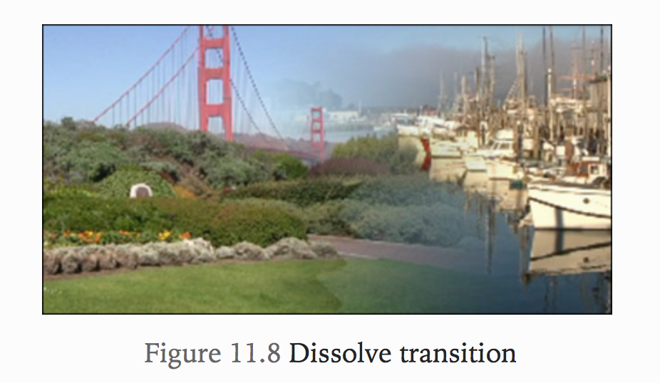
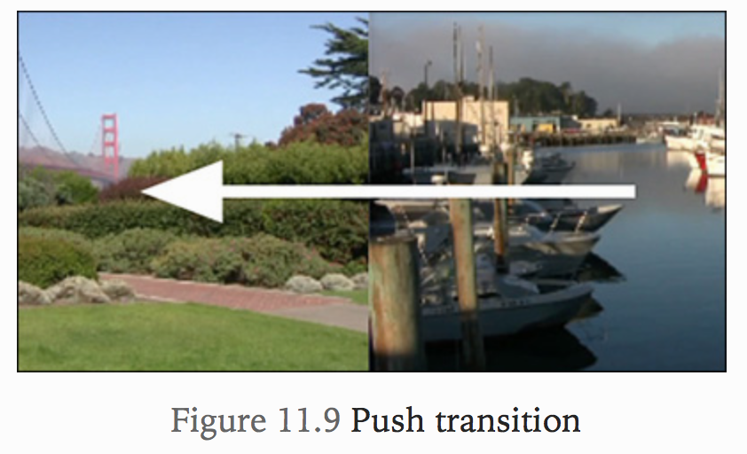

# 11. Building Video Transitions
이 장에서는 AV foundation의 비디오 트랜지션을 만드는 방법을 알아보고 이러한 기능이 어떻게 비디오 편집 어플리케이션 프로그램을 향상시키는데 도움이 되는지 살펴볼 것임.



## AVVideoComposition
* 비디오 트랜지션 API 중에서 중심이 되는 클래스는 `AVVideoComposition`임.
* 이 클래스는 2개 이상의 비디오 트랙이 함께 합성되는 방식에 대한 종합적인 설명을 제공함.

```
주목해야 할 중요한 점은 그 이름에도 불구하고, AVVideoComposition은 AVComposition의 서브 클래스가 아니며 심지어 직접적으로 AV Composition과 관련이 없다는 것입니다. 재생, 내보내기 또는 처리 할 때 자산의 비디오 트랙의 비디오 합성 동작을 제어하기 위해서만 사용됩니다.
```

## AVVideoCompositionInstruction
* AVVideoComposition은 `AVVideoCompositionInstruction`이라 불리는 객체의 형식으로 제공되는 명령들의 집합이다.
* 이 객체가 제공하는 핵심 데이터 중 하나는 컴포지션 타임라인 내에서 어떤 형태의 합성이 발생해야하는 시간 범위임.

## AVVideoCompositionLayerInstruction
* `AVVideoCompositionLayerInstruction`은 주어진 비디오 트랙에 적용된 불투명도, 변형 및 자르기 효과를 정의하는 데 사용됩니다.
* 이 클래스를 이용하여 시간 범위에 따라 이 값에 ramp효과를 주면 디졸브 및 페이드와 같은 애니메이션 전환 효과를 만들 수 있음.

```
AVAudioMix와 마찬가지로 AVVideoComposition은 AVComposition과 직접 연결되어 있지 않습니다. 대신 이러한 객체는 AVPlayerItem과 같은 클라이언트와 연결되며 컴포지션이 재생되거나 처리 될 때 사용됩니다. 언뜻보기에는 이상하게 보일 수 있지만이 디자인에는 이점이 있습니다. AVComposition을 출력 행동에 강력하게 연결하지 않으면 재생, 내보내기 또는 처리 할 때 해당 행동을 적용하는 방법을보다 유연하게 결정할 수 있습니다.
```

## Conceptual Steps
15초 앱 개발 과정에서 그림 11.2와 같이 타임 라인을 따라 순차적으로 배열 된 일련의 비디오 클립으로 단일 비디오 트랙으로 작업했습니다.



이 트랙 배열은 컷 전용 편집을 빌드 할 때 필요한 것입니다. 그러나 개별 비디오 세그먼트간에 애니메이션 전환을 수행해야 할 때 불충분합니다. 영상 효과를 만드는 효과적인 학습 방법은 과정을 일련의 단계로 분해하는 것입니다. 이것들은 실제로 프로세스를 이해하는데 도움이되는 개념적 단계이지만, 개념에 익숙해지면 두 개 또는 그 이상의 개념을 하나의 작업 단위로 결합하는 경우가 많습니다.

### 1 Stagger the Video Layout



* 클립 사이의 장면 전환을 활성화하려면 먼저 두 트랙에서 비디오 클립 레이아웃을 엇갈리게하여 시작해야함. 
* 컴포지션에서 여러 오디오 트랙을 사용하는 방법을 이미 보았으며 비디오 트랙에서도 마찬가지임.



### 2 Define Overlapping Regions
세그먼트 간 비디오 전환을 수행하려면 원하는 전환 기간만큼 세그먼트가 겹쳐져 있는지 확인해야함.



* 위 겹치는 시간만큼 재생시간이 줄어들었으므로 주의할것!

### 3 Calculate Pass-Through and Transition Time Ranges
* 앞서 AVVideoCompostion은 AVVideoCompositionInstruction 객체의 컬렉션으로 구성됩니다. 이 명령어가 포함하고있는 가장 중요한 데이터는 어떤 형태의 합성이 발생해야하는 시간 범위를 정의하는 시간 범위라고 했음.
* `AVVideoCompositionInstruction` 인스턴스를 만들기 시작하기 전에 먼저 합성을 위한 시간 범위를 구해야함.
* pass-through : 한 트랙의 전체 프레임이 다른 프레임과 블렌딩 없이 전달
* transition time range : 전환 시간 범위



```
Tip
CMTime과 CMTimeRange는 구조체이므로 NSArray나 NSDictionary에 직접 추가 할 수 없습니다. 대신 AVTime.h에 정의 된 범주 메서드를 사용하여 NSValue의 인스턴스를 래핑합니다.
```

위 과정은 되게 중요한 과정임. 다음과 같은 두가지를 반드시 지켜야 함.
* 계산하는 시간 범위에 틈이나 겹침이 없어야함. 새로운 시간 범위가 끝날 때마다 순차적으로 배치해야함.
* 계산은 총 구성 기간을 고려해야함. 음악 작품에 트랙이 추가로있는 경우 동영상 타임 라인에 맞추거나 마지막 시간 범위를 연장하여 음악 재생 시간을 고려해야함.

위의 두가지를 못지키면 영상은 까만색으로만 보임.
이를 위해 애플은 아래와 같은 훌륭한 유틸클래스를 제공함.



### 4 Build Composition and Layer Instructions
다음 단계는 비디오 합성기가 수행 할 지침을 제공하는 AVVideoCompositionInstruction 및 AVVideoCompositionLayerInstruction의 인스턴스를 작성하는 것임.

### 5 Build and Configure the AVVideoComposition
이제 다 했으니 AVVideoComposition의 인스턴스를 만들고 구성만 하면 됨.

`AVMutableVideoComposition`에는 아래와 같은 프로퍼티를 갖고있음
* instructions : instructions 속성은 4 단계에서 생성 된 컴포지션 instruction으로 설정됨. 이 instruction에서는 수행할 합성의 시간 범위와 특성을 컴포지션에게 설명함.
* renderSize : 이 컴포지션을 렌더링해야하는 크기를 정의하는 CGSize 값임. 제공된 값은 720p 비디오의 경우 1280 x 720, 1080p 컨텐츠의 경우 1920 x 1080과 같이 컴포지션 내에 포함 된 비디오의 자연 크기와 일치해야함.
* frameDuration : 유효 프레임 속도를 설정하는데 사용됨. AV Foundation은 프레임 속도를 거의 다루지 않지만 대신 프레임 지속 시간을 사용함. 프레임 지속 시간은 프레임 속도의 `역수`이므로 30FPS의 프레임 속도를 설정하려면 1 / 30th의 프레임 지속 시간을 정의하는것을 명심!
* renderScale : 비디오 컴포지션에 적용되는 배율을 정의함. 대부분의 경우이 값은 1.0으로 설정됨.

### Building Video Compositions the Auto-Magic Way
많은 경우에 이전 섹션에서 설명한 것보다 AVVideoComposition을 만드는 더 쉬운 방법이 있음. AVVideoComposition은 AVComposition을 Asset argument로 사용하고 기본 AVVideoComposition을 빌드하는 videoCompositionWithPropertiesOfAsset :이라는 편리한 초기화 프로그램을 제공합니다.

## Applying Transition Effects
어플리케이션은 Dissolve(기본값), Push 및 Wipe 세 가지 유형의 전환을 지원함.

### Dissolve Transition



```objectivec
// 예제코드
if (type == THVideoTransitionTypeDissolve) {

    [fromLayer setOpacityRampFromStartOpacity:1.0
                                 toEndOpacity:0.0
                                    timeRange:timeRange];
}
```

간단한 디졸브 전환을 구현하는 것은 쉽습니다. fromLayer에서 불투명도를 설정하여 전환 지속 시간 동안 불투명도를 기본값 1.0 (완전 불투명)에서 0.0 (완전 투명)으로 조정하면됩니다. 이렇게하면 현재 비디오를 다음 비디오로 분해 할 수 있습니다. 디졸브 전환의 다른 형태는 크로스 디졸브 (cross dissolve)라고하며, toLayer에 불투명도 램프를 설정하여 불투명도를 0.0에서 1.0으로 늘립니다. 간단한 디졸브는 더 섬세하고 일반적으로 더 좋아 보이지만 두 가지를 모두 시험해보고 어느 것이 가장 좋을지 알아 보시기 바랍니다.

### Push Transition
구현할 다음 전환은 푸시 전환입니다 (그림 11.9 참조). 이것은 다음 비디오가 현재 비디오를 "보이지 않게"밀어내는 방향 전환입니다.



```objectivec
else if (type == THVideoTransitionTypePush) {

    // Define starting and ending transforms                        // 1
    CGAffineTransform identityTransform = CGAffineTransformIdentity;

    CGFloat videoWidth = videoComposition.renderSize.width;

    CGAffineTransform fromDestTransform =
        CGAffineTransformMakeTranslation(-videoWidth, 0.0);

    CGAffineTransform toStartTransform =
        CGAffineTransformMakeTranslation(videoWidth, 0.0);

    [fromLayer setTransformRampFromStartTransform:identityTransform // 2
                                   toEndTransform:fromDestTransform
                                        timeRange:timeRange];

    [toLayer setTransformRampFromStartTransform:toStartTransform    // 3

else if (type == THVideoTransitionTypePush) {

    // Define starting and ending transforms                        // 1
    CGAffineTransform identityTransform = CGAffineTransformIdentity;

    CGFloat videoWidth = videoComposition.renderSize.width;

    CGAffineTransform fromDestTransform =
        CGAffineTransformMakeTranslation(-videoWidth, 0.0);

    CGAffineTransform toStartTransform =
        CGAffineTransformMakeTranslation(videoWidth, 0.0);

    [fromLayer setTransformRampFromStartTransform:identityTransform // 2
                                   toEndTransform:fromDestTransform
                                        timeRange:timeRange];

    [toLayer setTransformRampFromStartTransform:toStartTransform    // 3
                                 toEndTransform:identityTransform
                                      timeRange:timeRange];
}
```

### Wipe Transition
마지막으로 구현할 마지막 전환은 Wipe임(그림 11.10 참조). Wipe 트랜지션은 다양한 형태로 제공되지만 일반적으로 현재 비디오를 애니메이션 방식으로 이동시켜 다음 비디오를 보여줌.

```objectivec
else (type == THVideoTransitionTypeWipe) {

    CGFloat videoWidth = videoComposition.renderSize.width;
    CGFloat videoHeight = videoComposition.renderSize.height;

    CGRect startRect = CGRectMake(0.0f, 0.0f, videoWidth, videoHeight);
    CGRect endRect = CGRectMake(0.0f, videoHeight, videoWidth, 0.0f);

    [fromLayer setCropRectangleRampFromStartCropRectangle:startRect
                                       toEndCropRectangle:endRect
                                                timeRange:timeRange];
}
```