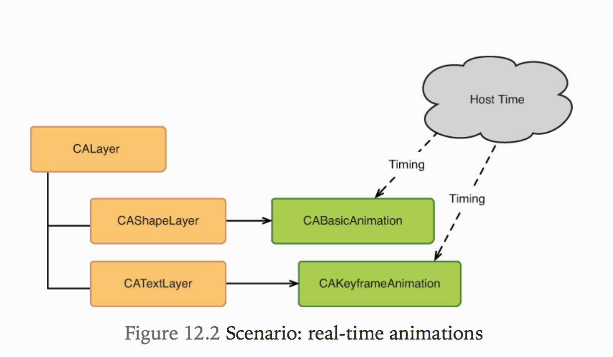
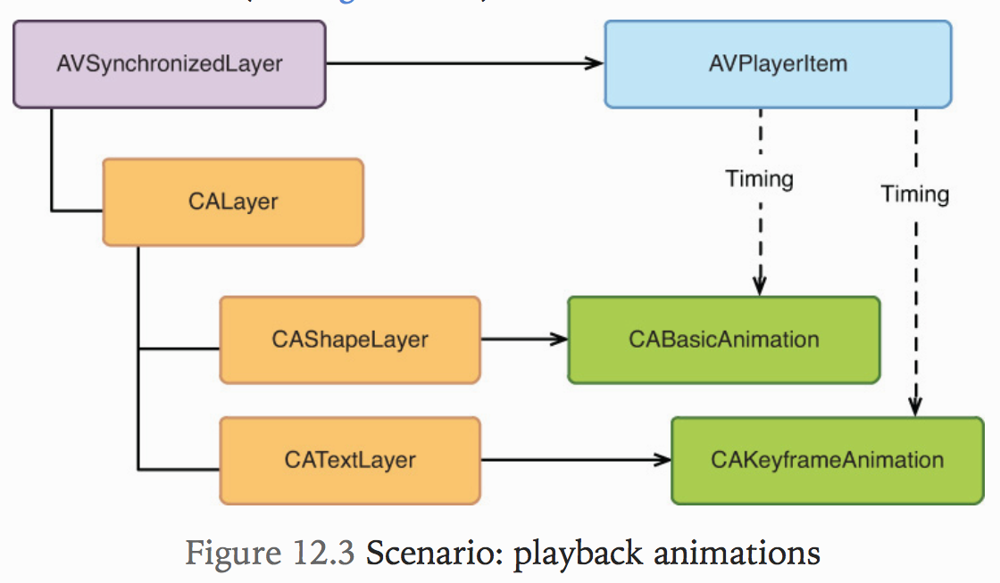
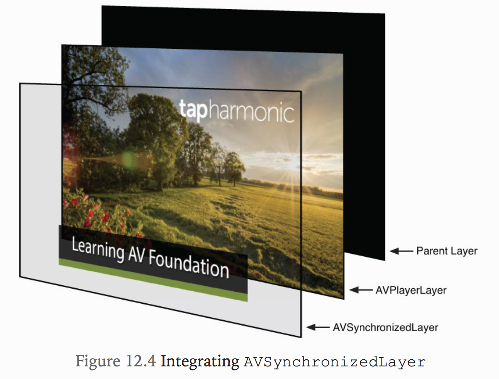
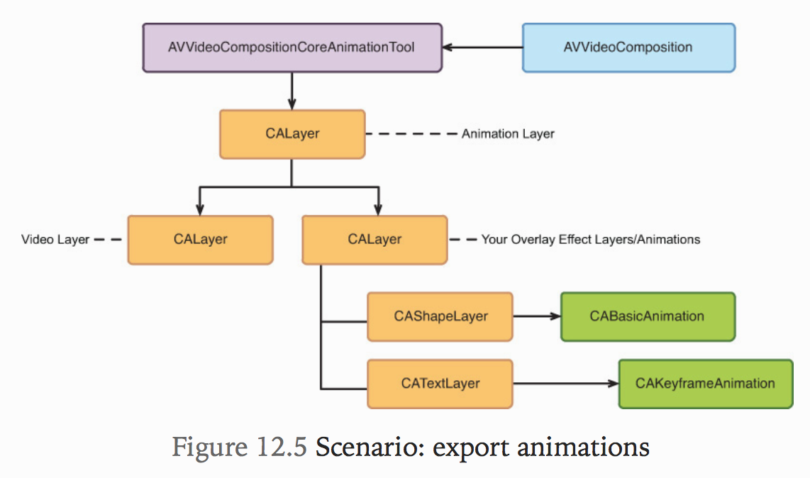

# 12. Layering Animated Content
이번 장에서는 AVFoundation과 Core Animation을 사용하여 오버레이효과 등 다양한 애니메이션 효과를 만들고 비디오 콘텐츠에 통합하는데 도움이되는 몇가지 클래스를 알아볼것이다.

## Using Core Animation
Core Animation은 Apple 플랫폼에서 볼 수 있는 환상적인 아름답고 유동적인 애니메이션을 가능하게하는 OS X 및 iOS에서 제공되는 합성 및 애니메이션 프레임워크이다.

높은 수준의 관점에서 Core Animation은 두 가지 유형의 객체로 구성된다.
* Layers : 레이어 개체는 CALayer 클래스에 의해 정의되며 화면상의 시각적 콘텐츠 요소를 관리하는 데 사용된다.
* Animations : 애니메이션 객체는 모든 애니메이션 유형에 공통적 인 핵심 애니메이션 동작을 정의하는 추상 CAAnimation 클래스의 인스턴스이다. 이 프레임 워크는 CAAnimation의 많은 구체적인 서브 클래스를 정의한다. 가장 주목할만한 것은 CABasicAnimation과 CAKeyFrameAnimation이다. 이 클래스는 상태 변경을 개별 레이어 속성에 애니메이션으로 적용하여 단순하거나 복잡한 애니메이션을 쉽게 제작할 수 있도록한다.

## Using Core Animation with AV Foundation
Core Animation을 사용하여 비디오 응용 프로그램에 대한 오버레이 효과를 만드는 것은 iOS 또는 OS X 용 실시간 애니메이션을 제작하는 것과 거의 동일하다. 가장 큰 차이점은 애니메이션을 실행하는데 사용되는 타이밍 모델에 있다. 실시간 애니메이션 작업을 할 때 CAAnimation의 인스턴스는 시스템 호스트 클럭에서 타이밍을 얻는다.

호스트 시간은 시스템 부팅에서 시작하여 무한대 방향으로 단조롭게 앞으로 진행된다. 호스트 시계에서 애니메이션 타이밍을 맞추는 것은 실시간 경우에는 잘 작동하지만 비디오 애니메이션을 제작하는데는 적합하지 않다. 비디오 애니메이션은 영화 시작 부분에서 시작하여 그 지속 시간까지 실행되는 "무비 시간"에 작동해야한다. 호스트 시간은 항상 앞으로 진행되고 멈추지 않으면서 영화 시간을 멈추거나, 일시 정지하거나, 되감거나, 빨리 감기 할 수 있다. 애니메이션이 비디오 타임 라인에 밀접하게 연결되도록하려면 다른 타이밍 모델을 사용해야한다. AV Foundation은 유스 케이스에 따라 두 가지 솔루션을 제공한다.

### Playback with AVSynchronizedLayer
AV Foundation은 AVPlayerItem의 주어진 인스턴스와 타이밍을 동기화하는 `AVSynchronizedLayer`라는 특수한 CALayer 서브 클래스를 제공한다. 이 레이어는 콘텐츠 자체를 표시하는데 사용되지 않고 단순히 타이밍을 레이어 하위 트리에 부여한다. 이렇게하면 계층 구조에 있는 레이어에 연결된 모든 애니메이션이 활성화 된 AVPlayerItem 인스턴스에서 타이밍을 가져올 수 있다. (그림 12.3 참조)

일반적으로 AVSynchronizedLayer를 사용하는 방식은 플레이어 뷰의 레이어 계층 구조에 이를 통합하는 것이다. 동기화 된 레이어는 비디오 레이어 바로 위에 나타난다(그림 12.4 참조). 이를 통해 플레이어의 전송 동작과 완벽하게 동기화 된 동영상 재생에 애니메이션 제목, 워터 마크 또는 더 낮은 3 분의 1을 추가 할 수 있다.

AVSynchronizedLayer의 주요 사용 사례는 비디오 내용 위에 레이어 된 내용의 애니메이션을 적용하는 것이지만, 이것이 유용 할 수있는 유일한 방법은 아니다. 15 초 앱에서 음악을 재생하면 애니메이션 재생 헤드가 재생과 동시에 움직이는 것을 보았다. 이는 AVSynchronizedLayer 덕분에 가능하다. 프로젝트에서는 Views 그룹 아래에 `THPlayheadView`라는 클래스가 있다. 새로운 AVPlayerItem이 생성 될 때마다 응용 프로그램은이 뷰의 synchronizeWithPlayerItem : 메서드를 호출한다. 이 메서드는 수직선을 그리는 두 개의 CAShapeLayer 인스턴스와 비디오가 재생 될 때 해당 레이어의 x 위치에 애니메이션을 적용하는 CABasicAnimation의 인스턴스를 만든다. 여기서 이 뷰에 대한 세부 사항을 다루지는 않겠지 만 이 클래스의 구현을 살펴봄으로써 해당 클래스의 작동 방식을보다 잘 이해할 것을 권장한다.

### Exporting with AVVideoCompositionCoreAnimationTool
Core Animation 레이어와 애니메이션을 내보낸 비디오에 통합하려면 `AVVideoCompositionCoreAnimationTool`이라는 클래스를 사용한다. 이 클래스는 AVVideoComposition에서 Core Animation 효과를 비디오 합성 사후 처리 단계로 통합하는데 사용된다 (그림 12.5 참조).

합성 된 비디오 프레임을 비디오 레이어에 배치 한 다음 사용자 정의 오버레이 이펙트가 포함 된 애니메이션 레이어를 렌더링하여 최종 비디오 프레임을 생성한다.
AVSynchronizedLayer 및 AVVideoCompositionCoreAnimationTool 사용에 대한 자세한 내용은 곧 논의 될 예정이지만 먼저 오버레이 효과를 만들 때 관찰해야 할 몇 가지 사항에 대해 설명하고자한다.

* Core Animation 프레임 워크의 기본 동작은 애니메이션을 실행하고 애니메이션 트랜잭션이 완료된 후에 처리하는 것이다. 이는 일반적으로 실시간 상황에서 원하는 동작이다. 시간이 지나면 다시 돌아올 수 없기 때문이다. 그러나 비디오 애니메이션의 경우 문제가 될 수 있으므로 애니메이션의 `removedOnCompletion` 속성을 `NO`로 설정하여이 동작을 비활성화해야한다. 그렇게하지 않으면 애니메이션을 한 번 보게된다. 그러나 동영상을 재생하거나 타임 라인에서 스크러빙하면 다시 볼 수 없다.

* beginTime이 0.0 인 애니메이션은 보이지 않는다!!. Core Animation은 beginTime을 0.0으로 변환하여 현재 호스트 시간 인 `CACurrentMediaTime()`을 영화의 타임 라인에서 유효한 시간과 일치시키지 않는다. 동영상의 맨 처음부터 애니메이션을 시작해야하는 경우 애니메이션의 beginTime 속성에 상수 값 `AVCoreAnimationBeginTimeAtZero`를 사용합니다.

* AVComposition과 함께 Core Animation을 사용하는데 따르는 어려움 중 하나는 사용 된 다른 개념 및 시간 모델을 조정하는 것이다. AVComposition으로 작업 할 때 트랙과 CMTime 및 CMTimeRange 값의 관점에서 생각하고 있다. Core Animation은 트랙에 대한 개념이 없으며 부동 소수점 값을 사용하여 시간을 지정한다. 간단한 시나리오에서는 용어로 Core Animation을 다룰 수 있지만 정교한 케이스를 만들 때는 각 프레임 워크에 공통 레벨의 추상화를 제공하여 컴포지션 및 애니메이션 제작을위한 정규화 된 모델을 제공하는 것이 좋다.

## Summary
`AVSynchronizedLayer`를 사용하여 비디오 재생에 Core Animation 효과를 포함시키는 방법을 배우고 `AVVideoCompositionCoreAnimationTool`을 사용하여 이러한 효과를 내보내기 프로세스에 통합하는 방법을 살펴 보았다. 비디오 프로젝트에 타이틀을 추가하는 AV Foundation의 접근 방식은 처음에는 조금 이상하게 보일 수 있지만, 이 접근 방식에 익숙해지면 AVeneration이 잘 작동한다. 이 장에서는 AV Foundation과 Core Animation의 통합을 단순화하기위한 하나의 솔루션에 대해서도 설명했다. 자신의 응용 프로그램에서 비슷한 디자인을 따르는 것이 더 크거나 복잡한 비디오 응용 프로그램을 제작할 때 도움이 될 수 있다고 생각한다.